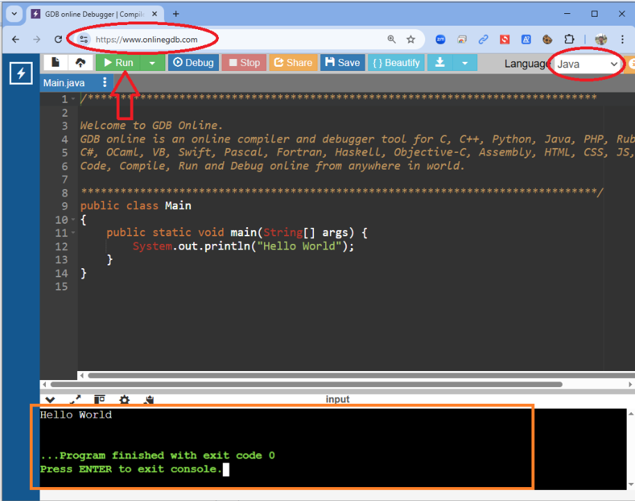

## 🧪 OnlineGDB (executar códigos online)

https://www.onlinegdb.com/

O site **onlinegdb** permite testarmos pequenos trechos de código sem a necessidade de instalarmos nenhum programa em nosso computador. Obviamente, ele é utilizado apenas para estudos iniciais. Posteriormente iremos utilizar uma IDE (Integrated Development Environment) como o **VSCode** para escrevermos os nossos códigos.

### ✅ Como usar
1. Acesse: http://www.onlinegdb.com  
2. Selecione a linguagem **JAVA** no canto direito da tela, conforme a imagem abaixo  
3. Clique no botão **RUN** (conforme apontado pela seta)  
4. Você verá o resultado da execução do programa de exemplo no painel preto inferior da janela, conforme identificado no quadrado na cor laranja.

### 🖼️ Imagem de referência

<!-- nav_start -->
---
Anterior: [Comandos de entrada e saída](../docs/9_Comandos_Entrada_Saida.md) | Próximo: [Comandos de entrada e saída de dados no JAVA](../docs/11_Entrada_Saida_Dados_Java.md) | [Voltar ao Índice](../README.md)
<!-- nav_end -->

