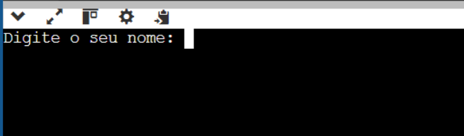
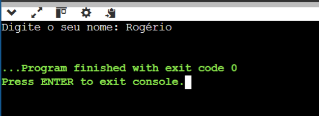

Comandos de entrada e saída de dados no JAVA

No java, para conseguirmos realizar o processo de leitura de dados através do terminal ou console, é necessário introduzirmos uma linha de código no início do arquivo. A estrutura básica de um programa em JAVA é essa:

public class Main
{
        public static void main(String[] args) {
                System.out.println("Hello World");
        }
}
Como em todo programa de console, provavelmente será necessário realizar a leitura de dados a partir do teclado. Se isto ocorrer, será necessário inserirmos o comando import java.util.Scanner; antes da linha que contem a palavra public e posteriomente a linha Scanner teclado = new Scanner(System.in); ficando assim:

import java.util.Scanner; //linha de codigo que permite utilizarmos o comando para a leitura de dados

public class Main
{
        public static void main(String[] args) {
                //a linha de codigo abaixo prepara o teclado para ler os diversos tipos de dados;
                Scanner teclado = new Scanner(System.in);      
        }
}
Quando um desenvolvedor está construindo um programa que precisa interagir com o usuário para obter informações, é necessário utilizarmos o comando System.out.print("Mensagem a ser apresentada para o usuário.") para informar ao usuário do programa o que ele deve fazer. 

Diferentemente do comando de leitura de dados, o comando de saída de dados não precisa de nenhum outro comando de apoio para funcionar. Vamos considerar que o programador precisa escrever um programa que precisa receber do usuário as informações do nome dele, do pai e da mãe.

Neste cenário, o programador deve instruir o computador a exibir em qual ordem ele deseja obter os dados. Assim o programador deve instruir o computador a apresentar uma informação na tela dizendo para o usuário o que ele deve digitar e um outro comando informando que o computador deve obter os dados que o usuário irá digitar. 

Para obtermos o nome do usuário seria necessário o seguinte bloco de código:

import java.util.Scanner; //linha de codigo que permite utilizarmos o comando para a leitura de dados

public class Main
{
    public static void main(String[] args) {
        //a linha de codigo abaixo prepara o teclado para ler os diversos tipos de dados;
        Scanner teclado = new Scanner(System.in);      
        
        System.out.print("Digite o seu nome: ");
        teclado.nextLine();
    }
}
Após escrever estes comandos e clicar no botão RUN, o seguinte resultado será apresentado:

Note que o programa não continua a execução enquanto o usuário não digitar um conjunto de dados qualquer e pressionar a tecla ENTER no teclado. Após o usuário pressionar ENTER, como não existe mais nenhum comando após a leitura do nome, o programa será finalizado.

Caso o programador agora queira obter o nome do pai e da mãe deste usuário, será necessário incluir mais dois conjuntos de comandos de saída e leitura de dados, para obter o nome do pai e da mãe. Nesta situação, teriamos que escrever o seguinte código.

import java.util.Scanner; //linha de codigo que permite utilizarmos o comando para a leitura de dados

public class Main
{
    public static void main(String[] args) {
        //a linha de codigo abaixo prepara o teclado para ler os diversos tipos de dados;
        Scanner teclado = new Scanner(System.in);      
        
        System.out.print("Digite o seu nome: ");
        teclado.nextLine();
        System.out.print("Digite o nome da sua Mãe: ");
        teclado.nextLine();
        System.out.print("Digite o nome do seu Pai: ");
        teclado.nextLine();
    }
}
O resultado da execução do programa seria:

Tente agora alterar este código para obter o endereço do usuário.