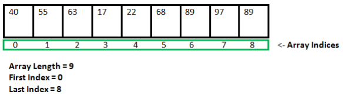

Vetores
Arrays são estruturas de dados que organizam uma sequência de elementos, facilitando o armazenamento e acesso de valores homogêneos (do mesmo tipo). Eles são como "listas" de valores, no entanto em Java uma lista é uma forma mais avançada de array, que veremos posteriormente.

Nesta organização, ou seja, no array tradicional, os dados ocupam uma posição específica dentro da sequência (array), identificada por um índice/número.

Esses índices geralmente começam no zero e aumentam sequencialmente, permitindo que cada elemento seja acessado diretamente pela sua posição dentro do array identificada pelo índice.

Na imagem abaixo temos um exemplo de um array com 9 posições identicadas por 0 até 8. Em cada posição temos um valor inteiro. Cada posição é identificada por um número que chamamos de índice. Por exemplo, o valor 55 está na posição 1, já o valor 89 está na posição 8.   

Como sempre teremos os índices iniciando em 0, a última posição sempre será identificada pela quantidade total de valores no índice - 1. Por exemplo, no vetror acima, temos 9 valores. Desta forma a última posição é identificada por 9 -1 que é 8.

Os arrays possuem as seguintes características:

Tamanho Fixo: Arrays geralmente possuem um tamanho definido no momento de sua criação. Uma vez estabelecido, esse tamanho não muda, e a estrutura armazena no máximo o número exato de elementos para o qual foi alocada.

Acesso Direto: Como os elementos estão dispostos em uma sequência fixa e ordenada, o acesso a um elemento específico é rápido, pois basta saber o índice para recuperá-lo diretamente, sem precisar percorrer toda a estrutura.

Homogeneidade: Arrays contêm elementos de um mesmo tipo, o que otimiza o uso de memória e facilita operações com todos os itens ao mesmo tempo.

Uso de Índices: Os elementos em um array são identificados por índices numéricos que indicam a posição de cada item. Isso permite iterar ou percorrer a estrutura de forma eficiente, acessando ou alterando valores de maneira controlada.

Arrays são amplamente usados em algoritmos e sistemas por sua simplicidade e eficiência na organização de dados que precisam ser manipulados de forma sequencial ou direta. No entanto, para estruturas que exigem maior flexibilidade de tamanho, outras estruturas de dados, como listas dinâmicas, são mais apropriadas.

Arrays no Java

type of array: tipo de dados utilizados no array

array variable name: nome da variável que define o array

element type: tipo do elemento que será armazenado em cada posição do array

length: quantidade de posições que o array terá

list of initialization values: valores que serão gravados no array durante a inicialização caso seja necessário

A imagem acima apresenta um exemplo na primeira linha, de como um vetor chamado myInts de 10 posições para números inteiros pode ser criado.

Na mesma imagem, na segunda linha temos um exemplo de como podemos criar e ao mesmo tempo inicializar um vetor com uma determinada sequencia de valores. Note que neste caso, não é necessário fazer new int[10] pois o próprio java conta a quantidade de valores dentro das { } para saber o tamanho do vetor.

A diferença entre a primeira linha e a segunda linha, é que na primeira é criado um vetor de 10 posições e as 10 posições não possuem conteúdo inicial. Já no segundo exemplo, é criado um vetor de 10 posições com os seguintes valores: 1 no índice 0, 5 no índice 1, 18 no índice 2 e assim sucessivamente.

Declarando Variáveis do Tipo Vetor

Na declaração de vetores deverão ser fornecidas três informações: 1) o nome do vetor, 2) o número de posições do vetor (seu tamanho), e 3) o tipo de dado que será armazenado no vetor. A declaração de um vetor para "inteiros", de nome "vetor", em Java:

int vetor[]; // declaração do vetor
Podemos notar que as declarações de vetores são semelhantes às declarações de variáveis, os elementos sintáticos que diferenciam as variáveis do tipo vetor das outras variáveis são os colchetes. Embora declarado, o vetor não está pronto para uso, sendo necessário reservar espaço para seus elementos (uma operação de alocação de memória).

vetor = new int[10]; // alocação de espaço para vetor
Na alocação de espaço, não repetimos os colchetes e utilizamos o operador new (uma palavra reservada da linguagem) para reservar espaço para 10 (dez) elementos do tipo int.

As duas declarações podem ser combinadas em um única, mais compacta:

int vetor[] = new int[10]; // declaração combinada

Exemplos de Declarações de Variáveis do Tipo Vetor

Na linguagem Java um vetor é uma "classe, portanto, deve-se utilizar o método new , que ativa o método construtor correspondente, para criar instâncias, ou exemplares, da classe vetor do tipo selecionado (int, double, float, char, String, entre outros), por exemplo:

a) declarando um vetor para armazenar 10 números inteiros

int nro = new int[10];

b) declarando um vetor para armazenar 10 valores do tipo real (ou monetários)

double salario = new double[10];

c) declarando um vetor para armazenar o nome dos 12 meses do ano

String mes = new String[12];
Em síntese

int n = 10; // tamanho do vetor
int v[] = new int[n]; // declaração e alocação de espaço para o vetor "v"
int i; // índice ou posição

// processando os "n" elementos do vetor "v"
for (i=0; i<n; i++) {
     v[i] = i; // na i-ésima posição do vetor "v" armazena o valor da variável "i"
}
Representação interna:

0	1	2	3	4	5	6	7	8	9
v[0]	v[1]	v[2]	v[3]	v[4]	v[5]	v[6]	v[7]	v[8]	v[9]

Aplicação Java exemplificando a utilização do tipo de dados vetor:

import java.util.Scanner;

public class App{
  public static void main(String[] args) {
    Scanner ler = new Scanner(System.in);

    int n = 10; // tamanho do vetor
    int v[] = new int[n]; // declaração do vetor "v"
    int i; // índice ou posição

    // Entrada de Dados
    for (i=0; i<n; i++) {
      System.out.printf("Informe %2dº valor de %d: ", (i+1), n);
      v[i] = ler.nextInt();
    }

    // Processamento: somar todos os valores, definir o maior e o menor valor
    int soma = 0;
    int menor = v[0]; // v[0] = 1º valor armazenador no vetor "v"
    int maior = v[0];

    //acessa cada valor do vetor
    for (i=0; i<n; i++) {
      soma = soma + v[i];

      //verifica se o valor do vetor na posicao i é menor que o valor gravado em menor
      if (v[i] < menor)
         menor = v[i]; //se for atualiza o valor da variavel menor com o valor do vetor na posicao i.

      //verifica se o valor do vetor na posicao i é maior que o valor gravado em maior
      if (v[i] > maior)
         maior = v[i]; //se for atualiza o valor da variavel maior com o valor do vetor na posicao i.
    }

    // Saída (resultados)
    System.out.printf("\n");

    for (i=0; i<n; i++) {
      if (v[i] == menor)
        System.out.printf("v[%d] = %2d <--- menor valor\n", i, v[i]);
      else if (v[i] == maior)
        System.out.printf("v[%d] = %2d <--- maior valor\n", i, v[i]);
      else 
        System.out.printf("v[%d] = %2d\n", i, v[i]);
    }

    System.out.printf("\nSoma = %d\n", soma);
  }
}

O resultado da  execução da aplicação é algo parecido com o resultado abaixo. Primeiro o algoritmo solicita o usuário digitar 10 valores. Depois acessa cada valor gravado no vetor para descobrir o menor e maior valor até o momento, Depois exibe a soma dos valores.

 

Informe o  1º valor de 10: 3
Informe o  2º valor de 10: 2

Informe o  3º valor de 10: 1

Informe o  4º valor de 10: 4

Informe o  5º valor de 10: 5

Informe o  6º valor de 10: 3

Informe o  7º valor de 10: 8

Informe o  8º valor de 10: 4

Informe o  9º valor de 10: 9

Informe o 10º valor de 10: 1

v[0] =  3

v[1] =  2

v[2] =  1 <--- menor valor

v[3] =  4

v[4] =  5

v[5] =  3

v[6] =  8

v[7] =  4

v[8] =  9 <--- maior valor

v[9] =  1 <--- menor valor

Soma = 40

---

**Complementos (para deixar o assunto mais completo e fácil de entender)**

### 1) Como “visualizar” um vetor de verdade (imagem mental)
Pense no vetor como **uma fileira de caixas numeradas**:

- Cada caixa tem um **índice** (0, 1, 2, 3…)
- Cada caixa guarda **um valor do mesmo tipo**
- Você acessa diretamente assim: `v[índice]`

Exemplo rápido:
    int[] v = {10, 55, 20, 7};

- `v[0]` → 10  
- `v[1]` → 55  
- `v[3]` → 7  

---

### 2) Regra de ouro do índice final
Se o vetor tem tamanho `n`, o **último índice é `n - 1`**.

Exemplo:
    int[] v = new int[10];

- tamanho: `v.length = 10`
- índices válidos: `0` até `9`
- último índice: `v.length - 1`

Se tentar acessar `v[10]` → erro: `ArrayIndexOutOfBoundsException`

---

### 3) `length` (vetor) vs `length()` (String)
Isso confunde muito iniciante:

- Vetor: `v.length`  (sem parênteses)
- String: `texto.length()` (com parênteses)

Exemplo:
    int[] v = new int[5];
    String texto = "Java";

    System.out.println(v.length);        // 5
    System.out.println(texto.length());  // 4

---

### 4) Inicialização: “vazio” não é “nulo”
Quando você cria um vetor numérico, ele vem com valores padrão:

- `int[]` → começa com `0`
- `double[]` → começa com `0.0`
- `boolean[]` → começa com `false`
- `char[]` → começa com `'\u0000'` (caractere vazio)
- `String[]` → começa com `null` (não aponta para texto ainda)

Exemplo:
    int[] v = new int[3];
    System.out.println(v[0]); // 0

    String[] nomes = new String[3];
    System.out.println(nomes[0]); // null

---

### 5) Padrões clássicos com vetor (o que mais cai em exercício)
#### a) Somatório (acumulador)
    int soma = 0;
    for (int i = 0; i < v.length; i++) {
        soma += v[i];
    }

#### b) Contagem (contador)
Exemplo: contar quantos são pares:
    int pares = 0;
    for (int i = 0; i < v.length; i++) {
        if (v[i] % 2 == 0) pares++;
    }

#### c) Maior e menor (comparação)
Dica importante: inicialize com `v[0]` (primeiro valor lido), não com 0.
    int maior = v[0];
    int menor = v[0];

    for (int i = 1; i < v.length; i++) {
        if (v[i] > maior) maior = v[i];
        if (v[i] < menor) menor = v[i];
    }

---

### 6) Erros comuns (para você evitar)
- **Começar o loop em 1** sem querer (e perder a posição 0).
- **Usar `<= v.length`** no for (o correto é `< v.length`).
- Ler `nextInt()` e depois usar `nextLine()` sem limpar buffer (pula leitura).
- Confundir `length` do vetor com `length()` da String.

---

### 7) Forma moderna de percorrer (for-each)
Quando você só quer “passar pelos valores”, sem precisar do índice:
    for (int valor : v) {
        System.out.println(valor);
    }

Mas atenção:
- for-each é ótimo para ler/mostrar
- para alterar posições, normalmente você precisa do índice com `for (i...)`

---

<!-- nav_start -->
---
Anterior: [Material Daniela - Preparação Curriculum](../docs/122_Material_Daniela_CV.md) | Próximo: [Inicialização de vetores](../docs/124_Inicializacao_Vetores.md) | [Voltar ao Índice](../README.md)
<!-- nav_end -->

