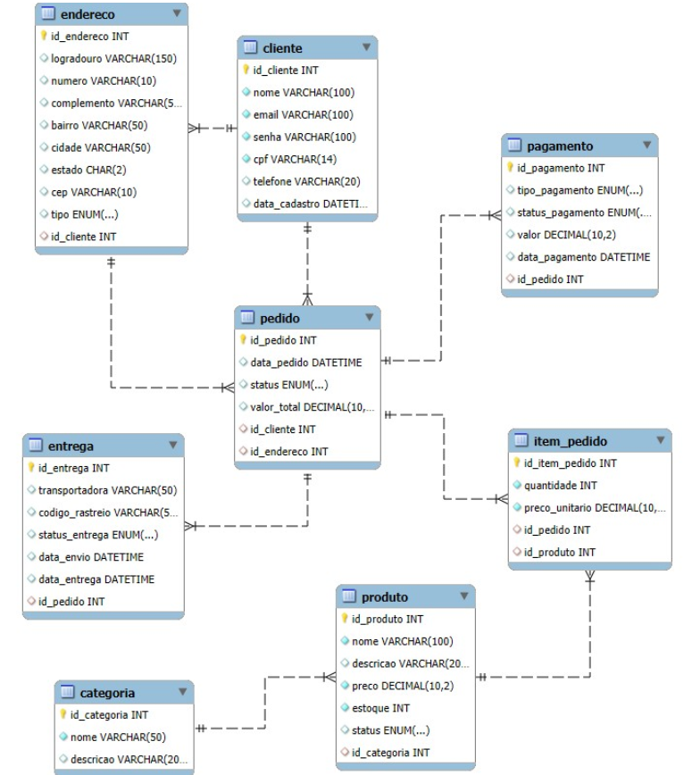

# Banco de Dados Loja Virtual (E-commerce)

---

## Visão Geral do Modelo
O sistema de loja virtual é composto basicamente por cinco grandes áreas:

- **Clientes e Endereços**
- **Produtos e Categorias**
- **Pedidos**
- **Pagamentos**
- **Entrega**

---

## Entidades (Tabelas) e Atributos (Colunas)

### Cliente
Representa o usuário comprador da loja.

- **id_cliente (PK)**
- **nome**
- **email**
- **senha**
- **cpf**
- **data_cadastro**
- **telefone**

**Obs:** Um cliente pode ter vários endereços e vários pedidos.

---

### Endereço
Usado para entrega e/ou cobrança.

- **id_endereco (PK)**
- **logradouro**
- **numero**
- **complemento**
- **bairro**
- **cidade**
- **estado**
- **cep**
- **tipo (entrega, cobrança)**
- **id_cliente (FK)**

**Obs:** Optamos por registrar os endereços na tabela endereços para que os clientes possam registrar mais de um endereço, como o endereço de correspondência e o endereço de entrega.

---

### Categoria
Organiza os produtos.

- **id_categoria (PK)**
- **nome**
- **descricao**

**Obs:** Uma categoria pode possuir vários produtos.

---

### Produto
Itens vendidos na loja.

- **id_produto (PK)**
- **nome**
- **descricao**
- **preco**
- **estoque**
- **status (ativo/inativo)**
- **id_categoria (FK)**

---

### Pedido
Representa uma compra realizada pelo cliente.

- **id_pedido (PK)**
- **data_pedido**
- **status (aberto, pago, enviado, cancelado)**
- **valor_total**
- **id_cliente (FK)**
- **id_endereco (FK)**

**Obs:** Um cliente pode fazer vários pedidos.

---

### ItemPedido
Tabela associativa entre Pedido e Produto.

- **id_item_pedido (PK)**
- **quantidade**
- **preco_unitario**
- **id_pedido (FK)**
- **id_produto (FK)**

**Obs:** Um pedido possui vários produtos e um produto pode estar em vários pedidos. A coluna **preco_unitario**, receberá um valor igual ao da coluna **preco** da tabela **produto**, caso não seja aplicado nenhum desconto na venda. Caso seja aplicado algum desconto, o valor da coluna **preco_unitario** será gravada com o valor final após o desconto. Optamos por não registrar o valor do percentual de desconto aplicado, pois este valor pode ser obtido dividindo o **preco_unitario** pelo **preco** e multiplicando por 100% **((preco_unitario / preco) * 100)**.

---

### Pagamento
Registra informações financeiras do pedido.

- **id_pagamento (PK)**
- **tipo_pagamento (cartão, pix, boleto)**
- **status_pagamento (pendente, aprovado, recusado)**
- **valor**
- **data_pagamento**
- **id_pedido (FK)**

**Obs:** Normalmente um pedido possui um pagamento (mas o modelo permite mais de um, se necessário).

---

### Entrega
Controle do envio do pedido.

- **id_entrega (PK)**
- **transportadora**
- **codigo_rastreio**
- **status_entrega**
- **data_envio**
- **data_entrega**
- **id_pedido (FK)**

---

## Relacionamentos (Resumo)

- **Cliente 1:N Endereço**
- **Cliente 1:N Pedido**
- **Categoria 1:N Produto**
- **Pedido 1:N ItemPedido**
- **Produto 1:N ItemPedido**
- **Pedido 1:1 Pagamento**
- **Pedido 1:1 Entrega**

---

## Diagrama Entidade Relacionamento

---

## Script de Criação do Banco de Dados

    CREATE DATABASE loja_virtual;

    USE loja_virtual;

    CREATE TABLE cliente (
        id_cliente INT AUTO_INCREMENT PRIMARY KEY,
        nome VARCHAR(100) NOT NULL,
        email VARCHAR(100) NOT NULL UNIQUE,
        senha VARCHAR(100) NOT NULL,
        cpf VARCHAR(14) NOT NULL UNIQUE,
        telefone VARCHAR(20),
        data_cadastro DATETIME DEFAULT CURRENT_TIMESTAMP
    );

    CREATE TABLE endereco (
        id_endereco INT AUTO_INCREMENT PRIMARY KEY,
        logradouro VARCHAR(150),
        numero VARCHAR(10),
        complemento VARCHAR(50),
        bairro VARCHAR(50),
        cidade VARCHAR(50),
        estado CHAR(2),
        cep VARCHAR(10),
        tipo ENUM('entrega','cobranca'),
        id_cliente INT,
        FOREIGN KEY (id_cliente) REFERENCES cliente(id_cliente)
    );

    CREATE TABLE categoria (
        id_categoria INT AUTO_INCREMENT PRIMARY KEY,
        nome VARCHAR(50) NOT NULL,
        descricao VARCHAR(200)
    );

    CREATE TABLE produto (
        id_produto INT AUTO_INCREMENT PRIMARY KEY,
        nome VARCHAR(100) NOT NULL,
        descricao VARCHAR(200),
        preco DECIMAL(10,2) NOT NULL,
        estoque INT NOT NULL,
        status ENUM('ativo','inativo'),
        id_categoria INT,
        FOREIGN KEY (id_categoria) REFERENCES categoria(id_categoria)
    );

    CREATE TABLE pedido (
        id_pedido INT AUTO_INCREMENT PRIMARY KEY,
        data_pedido DATETIME DEFAULT CURRENT_TIMESTAMP,
        status ENUM('aberto','pago','enviado','cancelado'),
        valor_total DECIMAL(10,2),
        id_cliente INT,
        id_endereco INT,
        FOREIGN KEY (id_cliente) REFERENCES cliente(id_cliente),
        FOREIGN KEY (id_endereco) REFERENCES endereco(id_endereco)
    );

    CREATE TABLE item_pedido (
        id_item_pedido INT AUTO_INCREMENT PRIMARY KEY,
        quantidade INT NOT NULL,
        preco_unitario DECIMAL(10,2) NOT NULL,
        id_pedido INT,
        id_produto INT,
        FOREIGN KEY (id_pedido) REFERENCES pedido(id_pedido),
        FOREIGN KEY (id_produto) REFERENCES produto(id_produto)
    );

    CREATE TABLE pagamento (
        id_pagamento INT AUTO_INCREMENT PRIMARY KEY,
        tipo_pagamento ENUM('cartao','pix','boleto'),
        status_pagamento ENUM('pendente','aprovado','recusado'),
        valor DECIMAL(10,2),
        data_pagamento DATETIME,
        id_pedido INT,
        FOREIGN KEY (id_pedido) REFERENCES pedido(id_pedido)
    );

    CREATE TABLE entrega (
        id_entrega INT AUTO_INCREMENT PRIMARY KEY,
        transportadora VARCHAR(50),
        codigo_rastreio VARCHAR(50),
        status_entrega ENUM('preparando','enviado','entregue'),
        data_envio DATETIME,
        data_entrega DATETIME,
        id_pedido INT,
        FOREIGN KEY (id_pedido) REFERENCES pedido(id_pedido)
    );

    INSERT INTO cliente (nome, email, senha, cpf, telefone) VALUES
    ('Ana Silva', 'ana@email.com', '123456', '111.111.111-11', '11999990001'),
    ('Bruno Costa', 'bruno@email.com', '123456', '222.222.222-22', '11999990002'),
    ('Carlos Lima', 'carlos@email.com', '123456', '333.333.333-33', '11999990003');

    INSERT INTO endereco (logradouro, numero, bairro, cidade, estado, cep, tipo, id_cliente) VALUES
    ('Rua A', '100', 'Centro', 'São Paulo', 'SP', '01000-000', 'entrega', 1),
    ('Rua B', '200', 'Centro', 'Campinas', 'SP', '13000-000', 'entrega', 2),
    ('Rua C', '300', 'Bairro Novo', 'Rio de Janeiro', 'RJ', '20000-000', 'entrega', 3);

    INSERT INTO categoria (nome, descricao) VALUES
    ('Eletrônicos', 'Produtos eletrônicos em geral'),
    ('Informática', 'Computadores e acessórios'),
    ('Livros', 'Livros físicos');

    INSERT INTO produto (nome, descricao, preco, estoque, status, id_categoria) VALUES
    ('Notebook Dell', 'Notebook i5 16GB', 4500.00, 10, 'ativo', 2),
    ('Mouse Gamer', 'Mouse RGB', 150.00, 50, 'ativo', 2),
    ('Smartphone Samsung', 'Galaxy S', 3200.00, 15, 'ativo', 1),
    ('Livro SQL', 'Aprenda SQL do zero', 90.00, 100, 'ativo', 3);

    INSERT INTO pedido (status, valor_total, id_cliente, id_endereco) VALUES
    ('pago', 4650.00, 1, 1),
    ('pago', 3200.00, 2, 2);

    INSERT INTO item_pedido (quantidade, preco_unitario, id_pedido, id_produto) VALUES
    (1, 4500.00, 1, 1),
    (1, 150.00, 1, 2),
    (1, 3200.00, 2, 3);

    INSERT INTO pagamento (tipo_pagamento, status_pagamento, valor, data_pagamento, id_pedido) VALUES
    ('cartao', 'aprovado', 4650.00, NOW(), 1),
    ('pix', 'aprovado', 3200.00, NOW(), 2);

    INSERT INTO entrega (transportadora, codigo_rastreio, status_entrega, data_envio, id_pedido) VALUES
    ('Correios', 'BR123456', 'enviado', NOW(), 1),
    ('Jadlog', 'JD654321', 'preparando', NOW(), 2);

---

## Exercícios

### BLOCO 1: SELECT (BÁSICO)
- Liste todos os clientes cadastrados.
- Exiba apenas nome e email dos clientes.
- Liste todos os produtos ativos.
- Liste os produtos com preço maior que R$ 500,00.
- Liste os pedidos com status 'pago'.
- Exiba todos os pedidos ordenados pela data do pedido (mais recente primeiro).
- Liste os produtos cujo nome contenha a palavra 'Notebook'.

---

### BLOCO 2: SELECT COM JOIN
- Liste o nome do cliente e o status de seus pedidos.
- Liste os pedidos com o nome do cliente e a cidade de entrega.
- Liste os produtos comprados em cada pedido.
- Liste o nome do produto, a quantidade e o valor total do item (quantidade × preço).
- Liste os pedidos com o valor total e o tipo de pagamento.
- Liste o código de rastreio e o nome do cliente.
- Liste os clientes que já realizaram pedidos.

---

### BLOCO 3: FUNÇÕES SQL
- Exiba o total de clientes cadastrados.
- Exiba o valor médio dos produtos.
- Exiba o produto mais caro.
- Exiba o produto mais barato.
- Exiba o valor total vendido pela loja.
- Exiba o total vendido por cliente.
- Liste os pedidos mostrando o ano e mês da data do pedido.
- Exiba o nome dos clientes em letras maiúsculas.
- Exiba os produtos com o preço arredondado.
- Exiba quantos pedidos existem por status.

---

### BLOCO 4: INSERT
- Insira um novo cliente fictício.
- Insira um endereço para esse cliente.
- Cadastre uma nova categoria chamada "Acessórios".
- Cadastre dois produtos nessa categoria.
- Crie um novo pedido para esse cliente.
- Insira os itens desse pedido.
- Registre o pagamento desse pedido.
- Registre a entrega desse pedido.

---

### BLOCO 5: UPDATE
- Atualize o telefone de um cliente.
- Altere o status de um produto para inativo.
- Atualize o estoque de um produto após uma venda.
- Atualize o status de um pedido para 'enviado'.
- Atualize o status da entrega para 'entregue'.
- Atualize a data de entrega para a data atual.
- Aplique um aumento de 10% no preço de todos os produtos da categoria Informática.
- Atualize o status de pagamento para 'recusado' de um pedido específico.

---

### DESAFIOS (OPCIONAL)
- Liste os produtos que nunca foram vendidos.
- Liste os clientes que nunca fizeram pedidos.
- Exiba o produto mais vendido (em quantidade).
- Exiba o cliente que mais gastou.
- Liste os pedidos cujo valor total seja maior que a média dos pedidos.

---

# Opção melhorada

---

## Complementos essenciais para deixar o modelo mais robusto (sem mudar sua base)

### 1) Ajustes de integridade referencial (FK) com comportamento de deleção
No seu script, as FKs estão corretas, mas não definem comportamento em deleções/atualizações. Em e-commerce, é comum:

- **Endereço**: ao deletar cliente, deletar endereços (**CASCADE**)
- **Pedido**: geralmente **não** se apaga pedido (histórico). Se apagar cliente, pode bloquear (**RESTRICT**) ou permitir (**SET NULL**) dependendo do projeto didático.
- **Itens/Pagamento/Entrega**: se apagar pedido, normalmente apaga registros filhos (**CASCADE**)

**Exemplo (uma versão didática bem comum):**
    ALTER TABLE endereco
      DROP FOREIGN KEY endereco_ibfk_1,
      ADD CONSTRAINT fk_endereco_cliente
      FOREIGN KEY (id_cliente) REFERENCES cliente(id_cliente)
      ON DELETE CASCADE
      ON UPDATE CASCADE;

    ALTER TABLE item_pedido
      DROP FOREIGN KEY item_pedido_ibfk_1,
      ADD CONSTRAINT fk_item_pedido_pedido
      FOREIGN KEY (id_pedido) REFERENCES pedido(id_pedido)
      ON DELETE CASCADE
      ON UPDATE CASCADE;

    ALTER TABLE pagamento
      DROP FOREIGN KEY pagamento_ibfk_1,
      ADD CONSTRAINT fk_pagamento_pedido
      FOREIGN KEY (id_pedido) REFERENCES pedido(id_pedido)
      ON DELETE CASCADE
      ON UPDATE CASCADE;

    ALTER TABLE entrega
      DROP FOREIGN KEY entrega_ibfk_1,
      ADD CONSTRAINT fk_entrega_pedido
      FOREIGN KEY (id_pedido) REFERENCES pedido(id_pedido)
      ON DELETE CASCADE
      ON UPDATE CASCADE;

---

### 2) Garantir “1:1” real para Pagamento e Entrega
Você descreveu **Pedido 1:1 Pagamento** e **Pedido 1:1 Entrega**, mas no banco isso só vira 1:1 de verdade se `pagamento.id_pedido` e `entrega.id_pedido` forem **UNIQUE**.

**Exemplo:**
    ALTER TABLE pagamento
      ADD CONSTRAINT uq_pagamento_pedido UNIQUE (id_pedido);

    ALTER TABLE entrega
      ADD CONSTRAINT uq_entrega_pedido UNIQUE (id_pedido);

---

### 3) Campos NOT NULL onde faz sentido
Alguns campos centrais podem ser obrigatórios para evitar registros “meio vazios”:

- `endereco.logradouro`, `cidade`, `estado`, `cep`, `tipo`
- `pedido.status`, `pedido.valor_total`, `pedido.id_cliente`, `pedido.id_endereco`
- `produto.status`
- `pagamento.valor`, `pagamento.status_pagamento`, `pagamento.tipo_pagamento`

---

### 4) Índices para performance em JOIN e filtros
Essas colunas são usadas o tempo todo:

- `pedido.id_cliente`, `pedido.id_endereco`
- `produto.id_categoria`
- `item_pedido.id_pedido`, `item_pedido.id_produto`
- `pagamento.id_pedido`, `entrega.id_pedido`

**Exemplo:**
    CREATE INDEX idx_pedido_cliente ON pedido (id_cliente);
    CREATE INDEX idx_pedido_endereco ON pedido (id_endereco);

    CREATE INDEX idx_produto_categoria ON produto (id_categoria);

    CREATE INDEX idx_item_pedido_pedido ON item_pedido (id_pedido);
    CREATE INDEX idx_item_pedido_produto ON item_pedido (id_produto);

---

## Gabarito prático (consultas-modelo) dos exercícios

### BLOCO 1: SELECT (BÁSICO)
    -- 1) Todos os clientes
    SELECT * FROM cliente;

    -- 2) Nome e email
    SELECT nome, email FROM cliente;

    -- 3) Produtos ativos
    SELECT * FROM produto
    WHERE status = 'ativo';

    -- 4) Produtos com preço > 500
    SELECT * FROM produto
    WHERE preco > 500.00;

    -- 5) Pedidos pagos
    SELECT * FROM pedido
    WHERE status = 'pago';

    -- 6) Pedidos por data (mais recente primeiro)
    SELECT * FROM pedido
    ORDER BY data_pedido DESC;

    -- 7) Produtos contendo "Notebook"
    SELECT * FROM produto
    WHERE nome LIKE '%Notebook%';

---

### BLOCO 2: SELECT COM JOIN
    -- 1) Nome do cliente e status do pedido
    SELECT c.nome, p.status
    FROM pedido p
    JOIN cliente c ON c.id_cliente = p.id_cliente;

    -- 2) Pedido + cliente + cidade de entrega
    SELECT p.id_pedido, c.nome, e.cidade, p.status, p.valor_total
    FROM pedido p
    JOIN cliente c ON c.id_cliente = p.id_cliente
    JOIN endereco e ON e.id_endereco = p.id_endereco;

    -- 3) Produtos comprados em cada pedido
    SELECT p.id_pedido, pr.nome AS produto, ip.quantidade
    FROM item_pedido ip
    JOIN pedido p ON p.id_pedido = ip.id_pedido
    JOIN produto pr ON pr.id_produto = ip.id_produto
    ORDER BY p.id_pedido;

    -- 4) Produto, quantidade e total do item (qtd * preço)
    SELECT pr.nome AS produto,
           ip.quantidade,
           ip.preco_unitario,
           (ip.quantidade * ip.preco_unitario) AS total_item
    FROM item_pedido ip
    JOIN produto pr ON pr.id_produto = ip.id_produto;

    -- 5) Pedido com valor total e tipo de pagamento
    SELECT p.id_pedido, p.valor_total, pg.tipo_pagamento, pg.status_pagamento
    FROM pedido p
    JOIN pagamento pg ON pg.id_pedido = p.id_pedido;

    -- 6) Código de rastreio e nome do cliente
    SELECT c.nome, en.codigo_rastreio, en.status_entrega
    FROM entrega en
    JOIN pedido p ON p.id_pedido = en.id_pedido
    JOIN cliente c ON c.id_cliente = p.id_cliente;

    -- 7) Clientes que já realizaram pedidos
    SELECT DISTINCT c.id_cliente, c.nome, c.email
    FROM cliente c
    JOIN pedido p ON p.id_cliente = c.id_cliente;

---

### BLOCO 3: FUNÇÕES SQL
    -- 1) Total de clientes
    SELECT COUNT(*) AS total_clientes
    FROM cliente;

    -- 2) Valor médio dos produtos
    SELECT AVG(preco) AS preco_medio
    FROM produto;

    -- 3) Produto mais caro
    SELECT * FROM produto
    ORDER BY preco DESC
    LIMIT 1;

    -- 4) Produto mais barato
    SELECT * FROM produto
    ORDER BY preco ASC
    LIMIT 1;

    -- 5) Valor total vendido (somando pedidos pagos)
    SELECT SUM(valor_total) AS total_vendido
    FROM pedido
    WHERE status = 'pago';

    -- 6) Total vendido por cliente
    SELECT c.nome, SUM(p.valor_total) AS total_gasto
    FROM pedido p
    JOIN cliente c ON c.id_cliente = p.id_cliente
    WHERE p.status = 'pago'
    GROUP BY c.id_cliente, c.nome
    ORDER BY total_gasto DESC;

    -- 7) Pedidos com ano e mês
    SELECT id_pedido,
           YEAR(data_pedido) AS ano,
           MONTH(data_pedido) AS mes,
           status,
           valor_total
    FROM pedido;

    -- 8) Nome dos clientes em maiúsculas
    SELECT UPPER(nome) AS nome_maiusculo, email
    FROM cliente;

    -- 9) Produtos com preço arredondado
    SELECT nome, preco, ROUND(preco, 0) AS preco_arredondado
    FROM produto;

    -- 10) Quantos pedidos por status
    SELECT status, COUNT(*) AS qtde
    FROM pedido
    GROUP BY status;

---

### BLOCO 4: INSERT (exemplo completo)
    -- 1) Novo cliente
    INSERT INTO cliente (nome, email, senha, cpf, telefone)
    VALUES ('Debora Teste', 'debora@teste.com', '123456', '444.444.444-44', '11999990004');

    -- 2) Endereço do cliente (ajuste o id_cliente se necessário)
    INSERT INTO endereco (logradouro, numero, bairro, cidade, estado, cep, tipo, id_cliente)
    VALUES ('Rua D', '400', 'Centro', 'São Paulo', 'SP', '01111-111', 'entrega', 4);

    -- 3) Nova categoria
    INSERT INTO categoria (nome, descricao)
    VALUES ('Acessórios', 'Acessórios e periféricos');

    -- 4) Dois produtos na categoria (ajuste id_categoria se necessário)
    INSERT INTO produto (nome, descricao, preco, estoque, status, id_categoria)
    VALUES
    ('Teclado Mecânico', 'Switch azul', 350.00, 30, 'ativo', 4),
    ('Headset Gamer', 'Som surround', 280.00, 40, 'ativo', 4);

    -- 5) Novo pedido (ajuste ids)
    INSERT INTO pedido (status, valor_total, id_cliente, id_endereco)
    VALUES ('pago', 630.00, 4, 4);

    -- 6) Itens do pedido (ajuste id_pedido e ids dos produtos)
    INSERT INTO item_pedido (quantidade, preco_unitario, id_pedido, id_produto)
    VALUES
    (1, 350.00, 3, 5),
    (1, 280.00, 3, 6);

    -- 7) Pagamento
    INSERT INTO pagamento (tipo_pagamento, status_pagamento, valor, data_pagamento, id_pedido)
    VALUES ('pix', 'aprovado', 630.00, NOW(), 3);

    -- 8) Entrega
    INSERT INTO entrega (transportadora, codigo_rastreio, status_entrega, data_envio, id_pedido)
    VALUES ('Correios', 'BR999999', 'preparando', NOW(), 3);

---

### BLOCO 5: UPDATE (exemplos)
    -- 1) Atualizar telefone
    UPDATE cliente
    SET telefone = '11999990099'
    WHERE id_cliente = 1;

    -- 2) Produto inativo
    UPDATE produto
    SET status = 'inativo'
    WHERE id_produto = 2;

    -- 3) Baixar estoque (exemplo: vendeu 1 unidade do produto 1)
    UPDATE produto
    SET estoque = estoque - 1
    WHERE id_produto = 1;

    -- 4) Pedido para enviado
    UPDATE pedido
    SET status = 'enviado'
    WHERE id_pedido = 2;

    -- 5) Entrega entregue
    UPDATE entrega
    SET status_entrega = 'entregue'
    WHERE id_pedido = 1;

    -- 6) Data de entrega = hoje
    UPDATE entrega
    SET data_entrega = NOW()
    WHERE id_pedido = 1;

    -- 7) Aumento de 10% na categoria Informática
    UPDATE produto p
    JOIN categoria c ON c.id_categoria = p.id_categoria
    SET p.preco = p.preco * 1.10
    WHERE c.nome = 'Informática';

    -- 8) Pagamento recusado de um pedido
    UPDATE pagamento
    SET status_pagamento = 'recusado'
    WHERE id_pedido = 2;

---

## DESAFIOS (OPCIONAL) — consultas-modelo

    -- 1) Produtos nunca vendidos
    SELECT pr.*
    FROM produto pr
    LEFT JOIN item_pedido ip ON ip.id_produto = pr.id_produto
    WHERE ip.id_item_pedido IS NULL;

    -- 2) Clientes que nunca fizeram pedidos
    SELECT c.*
    FROM cliente c
    LEFT JOIN pedido p ON p.id_cliente = c.id_cliente
    WHERE p.id_pedido IS NULL;

    -- 3) Produto mais vendido (em quantidade)
    SELECT pr.nome, SUM(ip.quantidade) AS total_vendido
    FROM item_pedido ip
    JOIN produto pr ON pr.id_produto = ip.id_produto
    GROUP BY pr.id_produto, pr.nome
    ORDER BY total_vendido DESC
    LIMIT 1;

    -- 4) Cliente que mais gastou
    SELECT c.nome, SUM(p.valor_total) AS total_gasto
    FROM pedido p
    JOIN cliente c ON c.id_cliente = p.id_cliente
    WHERE p.status = 'pago'
    GROUP BY c.id_cliente, c.nome
    ORDER BY total_gasto DESC
    LIMIT 1;

    -- 5) Pedidos com valor_total maior que a média
    SELECT *
    FROM pedido
    WHERE valor_total > (SELECT AVG(valor_total) FROM pedido);
<!-- nav_start -->
---
Anterior: [Banco de Dados Agenda Telefônica](../docs/143_Agenda_Telefonica.md) | Próximo: [Banco de Dados Sistema Escolar](../docs/145_Sistema_Escolar.md) | [Voltar ao Índice](../README.md)
<!-- nav_end -->

