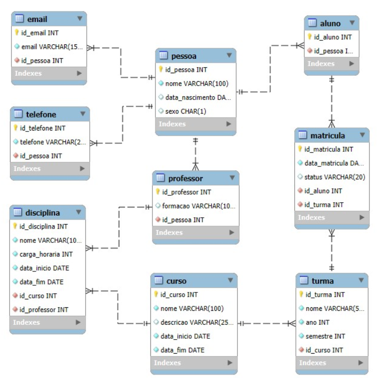

# Banco de Dados Sistema Escolar

Aqui temos um banco de dados para armazenar informações de um sistema escolar. Neste modelo é possível gerenciar alunos, professores, cursos, disciplinas, turmas e matrículas.

---

## Visão Geral do Modelo
O sistema é composto basicamente por seis grandes áreas:

- **Alunos**
- **Professores**
- **Cursos**
- **Turmas**
- **Disciplinas**
- **Matrícula**

---

## Entidades (tabelas) e Atributos (colunas)

### PESSOA
- **id_pessoa (PK)**
- **nome**
- **data_nascimento**
- **sexo**

**Obs:** Entidade genérica que representa indivíduos do sistema.

---

### ALUNO
- **id_aluno (PK)**
- **id_pessoa (FK, UNIQUE)**

**Obs:** Especialização de Pessoa.

---

### PROFESSOR
- **id_professor (PK)**
- **formacao**
- **id_pessoa (FK, UNIQUE)**

**Obs:** Especialização de Pessoa.

---

### EMAIL
- **id_email (PK)**
- **email**
- **id_pessoa (FK)**

**Obs:** Uma pessoa pode possuir vários e-mails.

---

### TELEFONE
- **id_telefone (PK)**
- **telefone**
- **id_pessoa (FK)**

**Obs:** Uma pessoa pode possuir vários telefones.

---

### CURSO
- **id_curso (PK)**
- **nome**
- **descricao**
- **data_inicio**
- **data_fim**

---

### DISCIPLINA
- **id_disciplina (PK)**
- **nome**
- **carga_horaria**
- **data_inicio**
- **data_fim**
- **id_curso (FK)**
- **id_professor (FK)**

---

### TURMA
- **id_turma (PK)**
- **nome**
- **ano**
- **semestre**
- **id_curso (FK)**

---

### MATRÍCULA
- **id_matricula (PK)**
- **data_matricula**
- **status**
- **id_aluno (FK)**
- **id_turma (FK)**

---

## Relacionamentos e Cardinalidades

### PESSOA (1,N) — EMAIL
Uma pessoa pode ter vários e-mails.

### PESSOA (1,N) — TELEFONE
Uma pessoa pode ter vários telefones.

### PESSOA (1,1) — ALUNO (especialização)
Um aluno é uma pessoa.

### PESSOA (1,1) — PROFESSOR (especialização)
Um professor é uma pessoa.

### CURSO (1,N) — DISCIPLINA
Um curso é composto por uma ou mais disciplinas.

### PROFESSOR (1,N) — DISCIPLINA
Um professor pode ministrar várias disciplinas.

### CURSO (1,N) — TURMA
Um curso pode ter várias turmas.

### ALUNO (1,N) — MATRÍCULA — (1,N) TURMA
Relacionamento muitos-para-muitos entre aluno e turma.

---

## Diagrama Entidade Relacionamento

---

## Script de Criação do Banco de Dados

    DROP DATABASE IF EXISTS sistema_escolar;
    CREATE DATABASE sistema_escolar;
    USE sistema_escolar;

    CREATE TABLE pessoa (
        id_pessoa INT AUTO_INCREMENT PRIMARY KEY,
        nome VARCHAR(100) NOT NULL,
        data_nascimento DATE,
        sexo CHAR(1)
    );

    CREATE TABLE email (
        id_email INT AUTO_INCREMENT PRIMARY KEY,
        email VARCHAR(150) NOT NULL,
        id_pessoa INT NOT NULL,
        CONSTRAINT fk_email_pessoa
            FOREIGN KEY (id_pessoa) REFERENCES pessoa(id_pessoa)
    );

    CREATE TABLE telefone (
        id_telefone INT AUTO_INCREMENT PRIMARY KEY,
        telefone VARCHAR(20) NOT NULL,
        id_pessoa INT NOT NULL,
        CONSTRAINT fk_telefone_pessoa
            FOREIGN KEY (id_pessoa) REFERENCES pessoa(id_pessoa)
    );

    CREATE TABLE aluno (
        id_aluno INT AUTO_INCREMENT PRIMARY KEY,
        id_pessoa INT NOT NULL UNIQUE,
        CONSTRAINT fk_aluno_pessoa
            FOREIGN KEY (id_pessoa) REFERENCES pessoa(id_pessoa)
    );

    CREATE TABLE professor (
        id_professor INT AUTO_INCREMENT PRIMARY KEY,
        formacao VARCHAR(100),
        id_pessoa INT NOT NULL UNIQUE,
        CONSTRAINT fk_professor_pessoa
            FOREIGN KEY (id_pessoa) REFERENCES pessoa(id_pessoa)
    );

    CREATE TABLE curso (
        id_curso INT AUTO_INCREMENT PRIMARY KEY,
        nome VARCHAR(100) NOT NULL,
        descricao VARCHAR(255),
        data_inicio DATE NOT NULL,
        data_fim DATE NOT NULL
    );

    CREATE TABLE disciplina (
        id_disciplina INT AUTO_INCREMENT PRIMARY KEY,
        nome VARCHAR(100) NOT NULL,
        carga_horaria INT NOT NULL,
        data_inicio DATE NOT NULL,
        data_fim DATE NOT NULL,
        id_curso INT NOT NULL,
        id_professor INT NOT NULL,
        CONSTRAINT fk_disciplina_curso
            FOREIGN KEY (id_curso) REFERENCES curso(id_curso),
        CONSTRAINT fk_disciplina_professor
            FOREIGN KEY (id_professor) REFERENCES professor(id_professor)
    );

    CREATE TABLE turma (
        id_turma INT AUTO_INCREMENT PRIMARY KEY,
        nome VARCHAR(50) NOT NULL,
        ano INT NOT NULL,
        semestre INT NOT NULL,
        id_curso INT NOT NULL,
        CONSTRAINT fk_turma_curso
            FOREIGN KEY (id_curso) REFERENCES curso(id_curso)
    );

    CREATE TABLE matricula (
        id_matricula INT AUTO_INCREMENT PRIMARY KEY,
        data_matricula DATE NOT NULL,
        status VARCHAR(20),
        id_aluno INT NOT NULL,
        id_turma INT NOT NULL,
        CONSTRAINT fk_matricula_aluno
            FOREIGN KEY (id_aluno) REFERENCES aluno(id_aluno),
        CONSTRAINT fk_matricula_turma
            FOREIGN KEY (id_turma) REFERENCES turma(id_turma)
    );

    INSERT INTO pessoa (nome, data_nascimento, sexo) VALUES
    ('João Pereira', '2002-05-10', 'M'),
    ('Maria Oliveira', '2001-08-22', 'F'),
    ('Pedro Santos', '2003-03-15', 'M'),
    ('Carlos Silva', '1980-04-12', 'M'),
    ('Ana Souza', '1985-09-30', 'F');

    INSERT INTO email (email, id_pessoa) VALUES
    ('joao@email.com', 1),
    ('maria@email.com', 2),
    ('pedro@email.com', 3),
    ('carlos@escola.com', 4),
    ('ana@escola.com', 5);

    INSERT INTO telefone (telefone, id_pessoa) VALUES
    ('11988880001', 1),
    ('11988880002', 2),
    ('11988880003', 3),
    ('11999990001', 4),
    ('11999990002', 5);

    INSERT INTO aluno (id_pessoa) VALUES
    (1),
    (2),
    (3);

    INSERT INTO professor (formacao, id_pessoa) VALUES
    ('Matemática', 4),
    ('Computação', 5);

    INSERT INTO curso (nome, descricao, data_inicio, data_fim) VALUES
    ('Sistemas de Informação', 'Curso de tecnologia', '2024-02-01', '2027-12-15');

    INSERT INTO disciplina (nome, carga_horaria, data_inicio, data_fim, id_curso, id_professor) VALUES
    ('Algoritmos', 80, '2024-02-15', '2024-06-30', 1, 2),
    ('Banco de Dados', 80, '2024-08-01', '2024-12-15', 1, 2);

    INSERT INTO turma (nome, ano, semestre, id_curso) VALUES
    ('SI-2024-1', 2024, 1, 1);

    INSERT INTO matricula (data_matricula, status, id_aluno, id_turma) VALUES
    ('2024-02-10', 'ATIVA', 1, 1),
    ('2024-02-10', 'ATIVA', 2, 1);

---

## Exercícios de SQL – Sistema Escolar

### NÍVEL 1 – Consultas Básicas (SELECT)
- Liste todos os alunos, exibindo apenas o nome e o sexo.
- Liste todos os professores e suas formações.
- Exiba todos os cursos com suas datas de início e fim.
- Liste todas as disciplinas cadastradas.
- Liste todas as turmas do ano de 2024.

---

### NÍVEL 2 – SELECT com WHERE e ORDER BY
- Liste os alunos do sexo feminino.
- Liste os professores com formação em Computação.
- Liste as disciplinas com carga horária maior ou igual a 80 horas.
- Exiba as turmas do 1º semestre, ordenadas pelo nome.
- Liste os cursos que terminam após o ano de 2026.

---

### NÍVEL 3 – JOIN (Relacionamentos)
- Liste o nome do aluno e o nome da turma em que ele está matriculado.
- Liste o nome do aluno e o nome do curso que ele está cursando.
- Liste o nome do professor e as disciplinas que ele ministra.
- Liste as disciplinas junto com o nome do curso ao qual pertencem.
- Liste o nome da turma e o nome do curso correspondente.

---

### NÍVEL 4 – JOIN com EMAIL e TELEFONE
- Liste o nome do aluno e seus e-mails.
- Liste o nome do professor e seus telefones.
- Liste todas as pessoas com seus respectivos e-mails.
- Liste os alunos que possuem mais de um telefone.
- Liste as pessoas que não possuem e-mail cadastrado.

---

### NÍVEL 5 – Funções de Agregação e GROUP BY
- Quantos alunos estão matriculados no sistema?
- Quantas disciplinas existem por curso?
- Quantos alunos existem em cada turma?
- Exiba o total de disciplinas ministradas por cada professor.
- Exiba o ano mais recente de início dos cursos.

---

### NÍVEL 6 – Subconsultas
- Liste os alunos matriculados na turma "SI-2024-1".
- Liste os professores que não ministram nenhuma disciplina.
- Liste os cursos que possuem mais de uma disciplina.
- Liste os alunos que não estão matriculados em nenhuma turma.
- Liste as disciplinas cujo período está dentro do intervalo do curso.

---

### NÍVEL 7 – Desafios (Integração Completa)
- Liste o nome do aluno, e-mail e telefone.
- Liste o nome do professor, sua formação e as disciplinas que ministra.
- Liste o nome do curso, suas disciplinas e o professor responsável.
- Liste os alunos, as turmas e os cursos, ordenados pelo nome do aluno.
- Gere um relatório com:
  - Nome do curso
  - Quantidade de turmas
  - Quantidade de disciplinas

---

# Opção melhorada

---

## Complementos essenciais (modelo + SQL) para deixar o sistema mais consistente

### 1) Regras de domínio (CHECK/ENUM) para `sexo` e `status`
Hoje `sexo` e `status` estão livres (CHAR/VARCHAR), o que facilita inconsistência (ex.: "Masculino", "m", "M ").

**Versão didática simples:**
- `sexo` como ENUM (`'M','F','O'`)
- `status` da matrícula como ENUM (`'ATIVA','TRANCADA','CANCELADA','CONCLUIDA'`)

    ALTER TABLE pessoa
      MODIFY sexo ENUM('M','F','O') NOT NULL;

    ALTER TABLE matricula
      MODIFY status ENUM('ATIVA','TRANCADA','CANCELADA','CONCLUIDA') NOT NULL;

---

### 2) Garantir “1:1” real na especialização Pessoa → Aluno/Professor
Você já colocou `UNIQUE` em `id_pessoa` (ótimo). Um complemento importante:
- impedir que um mesmo `id_pessoa` vire **aluno e professor** ao mesmo tempo (regra de negócio).
  - Em MySQL, isso costuma ser tratado via **trigger** ou pela aplicação.
  - Para um projeto didático, basta documentar a regra e validar na aplicação.

---

### 3) ON DELETE / ON UPDATE nas FKs
No modelo escolar, faz sentido:
- se apagar `pessoa`, apagar seus `emails/telefones` (**CASCADE**)
- se apagar `aluno`, apagar `matricula` (**CASCADE**) ou bloquear (**RESTRICT**) (didático: CASCADE costuma simplificar)
- se apagar `curso`, bloquear se existir `turma/disciplinas` ou cascata (aqui é melhor **RESTRICT** para evitar apagar “histórico”)

Exemplo (didático equilibrado):
    ALTER TABLE email
      DROP FOREIGN KEY fk_email_pessoa,
      ADD CONSTRAINT fk_email_pessoa
      FOREIGN KEY (id_pessoa) REFERENCES pessoa(id_pessoa)
      ON DELETE CASCADE
      ON UPDATE CASCADE;

    ALTER TABLE telefone
      DROP FOREIGN KEY fk_telefone_pessoa,
      ADD CONSTRAINT fk_telefone_pessoa
      FOREIGN KEY (id_pessoa) REFERENCES pessoa(id_pessoa)
      ON DELETE CASCADE
      ON UPDATE CASCADE;

    ALTER TABLE matricula
      DROP FOREIGN KEY fk_matricula_aluno,
      ADD CONSTRAINT fk_matricula_aluno
      FOREIGN KEY (id_aluno) REFERENCES aluno(id_aluno)
      ON DELETE CASCADE
      ON UPDATE CASCADE;

---

### 4) Evitar matrícula duplicada do mesmo aluno na mesma turma
Hoje nada impede o aluno ser matriculado duas vezes na mesma turma.

    ALTER TABLE matricula
      ADD CONSTRAINT uq_matricula_aluno_turma UNIQUE (id_aluno, id_turma);

---

### 5) Índices para consultas (JOIN e filtros)
Ajuda muito nos exercícios:

    CREATE INDEX idx_email_pessoa ON email (id_pessoa);
    CREATE INDEX idx_tel_pessoa ON telefone (id_pessoa);
    CREATE INDEX idx_aluno_pessoa ON aluno (id_pessoa);
    CREATE INDEX idx_prof_pessoa ON professor (id_pessoa);

    CREATE INDEX idx_disciplina_curso ON disciplina (id_curso);
    CREATE INDEX idx_disciplina_prof ON disciplina (id_professor);

    CREATE INDEX idx_turma_curso ON turma (id_curso);
    CREATE INDEX idx_matricula_turma ON matricula (id_turma);
    CREATE INDEX idx_matricula_aluno ON matricula (id_aluno);

---

## Gabarito (consultas-modelo) para os exercícios

### NÍVEL 1 – Consultas Básicas (SELECT)
    -- 1) Alunos: nome e sexo
    SELECT p.nome, p.sexo
    FROM aluno a
    JOIN pessoa p ON p.id_pessoa = a.id_pessoa;

    -- 2) Professores e formações
    SELECT p.nome, pr.formacao
    FROM professor pr
    JOIN pessoa p ON p.id_pessoa = pr.id_pessoa;

    -- 3) Cursos com datas
    SELECT nome, data_inicio, data_fim
    FROM curso;

    -- 4) Disciplinas cadastradas
    SELECT * FROM disciplina;

    -- 5) Turmas do ano 2024
    SELECT * FROM turma
    WHERE ano = 2024;

---

### NÍVEL 2 – WHERE e ORDER BY
    -- 1) Alunos do sexo feminino
    SELECT p.nome, p.sexo
    FROM aluno a
    JOIN pessoa p ON p.id_pessoa = a.id_pessoa
    WHERE p.sexo = 'F';

    -- 2) Professores com formação em Computação
    SELECT p.nome, pr.formacao
    FROM professor pr
    JOIN pessoa p ON p.id_pessoa = pr.id_pessoa
    WHERE pr.formacao = 'Computação';

    -- 3) Disciplinas com carga >= 80
    SELECT nome, carga_horaria
    FROM disciplina
    WHERE carga_horaria >= 80;

    -- 4) Turmas do 1º semestre ordenadas pelo nome
    SELECT *
    FROM turma
    WHERE semestre = 1
    ORDER BY nome;

    -- 5) Cursos que terminam após 2026
    SELECT *
    FROM curso
    WHERE YEAR(data_fim) > 2026;

---

### NÍVEL 3 – JOIN (Relacionamentos)
    -- 1) Aluno e turma
    SELECT p.nome AS aluno, t.nome AS turma
    FROM matricula m
    JOIN aluno a ON a.id_aluno = m.id_aluno
    JOIN pessoa p ON p.id_pessoa = a.id_pessoa
    JOIN turma t ON t.id_turma = m.id_turma;

    -- 2) Aluno e curso
    SELECT p.nome AS aluno, c.nome AS curso
    FROM matricula m
    JOIN aluno a ON a.id_aluno = m.id_aluno
    JOIN pessoa p ON p.id_pessoa = a.id_pessoa
    JOIN turma t ON t.id_turma = m.id_turma
    JOIN curso c ON c.id_curso = t.id_curso;

    -- 3) Professor e disciplinas
    SELECT pe.nome AS professor, d.nome AS disciplina
    FROM disciplina d
    JOIN professor pr ON pr.id_professor = d.id_professor
    JOIN pessoa pe ON pe.id_pessoa = pr.id_pessoa
    ORDER BY pe.nome, d.nome;

    -- 4) Disciplina e curso
    SELECT d.nome AS disciplina, c.nome AS curso
    FROM disciplina d
    JOIN curso c ON c.id_curso = d.id_curso;

    -- 5) Turma e curso
    SELECT t.nome AS turma, c.nome AS curso
    FROM turma t
    JOIN curso c ON c.id_curso = t.id_curso;

---

### NÍVEL 4 – JOIN com EMAIL e TELEFONE
    -- 1) Aluno e seus e-mails
    SELECT p.nome AS aluno, e.email
    FROM aluno a
    JOIN pessoa p ON p.id_pessoa = a.id_pessoa
    JOIN email e ON e.id_pessoa = p.id_pessoa
    ORDER BY p.nome;

    -- 2) Professor e seus telefones
    SELECT p.nome AS professor, t.telefone
    FROM professor pr
    JOIN pessoa p ON p.id_pessoa = pr.id_pessoa
    JOIN telefone t ON t.id_pessoa = p.id_pessoa
    ORDER BY p.nome;

    -- 3) Todas as pessoas com seus e-mails
    SELECT p.nome, e.email
    FROM pessoa p
    LEFT JOIN email e ON e.id_pessoa = p.id_pessoa
    ORDER BY p.nome;

    -- 4) Alunos com mais de um telefone
    SELECT p.nome, COUNT(t.id_telefone) AS qtde_telefones
    FROM aluno a
    JOIN pessoa p ON p.id_pessoa = a.id_pessoa
    JOIN telefone t ON t.id_pessoa = p.id_pessoa
    GROUP BY p.id_pessoa, p.nome
    HAVING COUNT(t.id_telefone) > 1;

    -- 5) Pessoas sem e-mail cadastrado
    SELECT p.*
    FROM pessoa p
    LEFT JOIN email e ON e.id_pessoa = p.id_pessoa
    WHERE e.id_email IS NULL;

---

### NÍVEL 5 – Agregação e GROUP BY
    -- 1) Quantos alunos matriculados no sistema (alunos cadastrados)
    SELECT COUNT(*) AS total_alunos
    FROM aluno;

    -- 2) Disciplinas por curso
    SELECT c.nome AS curso, COUNT(d.id_disciplina) AS qtde_disciplinas
    FROM curso c
    LEFT JOIN disciplina d ON d.id_curso = c.id_curso
    GROUP BY c.id_curso, c.nome;

    -- 3) Alunos em cada turma
    SELECT t.nome AS turma, COUNT(m.id_matricula) AS qtde_alunos
    FROM turma t
    LEFT JOIN matricula m ON m.id_turma = t.id_turma
    GROUP BY t.id_turma, t.nome;

    -- 4) Total de disciplinas por professor
    SELECT pe.nome AS professor, COUNT(d.id_disciplina) AS qtde_disciplinas
    FROM professor pr
    JOIN pessoa pe ON pe.id_pessoa = pr.id_pessoa
    LEFT JOIN disciplina d ON d.id_professor = pr.id_professor
    GROUP BY pr.id_professor, pe.nome;

    -- 5) Ano mais recente de início dos cursos
    SELECT MAX(YEAR(data_inicio)) AS ano_inicio_mais_recente
    FROM curso;

---

### NÍVEL 6 – Subconsultas
    -- 1) Alunos na turma "SI-2024-1"
    SELECT p.nome
    FROM matricula m
    JOIN aluno a ON a.id_aluno = m.id_aluno
    JOIN pessoa p ON p.id_pessoa = a.id_pessoa
    WHERE m.id_turma = (
        SELECT id_turma
        FROM turma
        WHERE nome = 'SI-2024-1'
    );

    -- 2) Professores que não ministram nenhuma disciplina
    SELECT pe.nome, pr.formacao
    FROM professor pr
    JOIN pessoa pe ON pe.id_pessoa = pr.id_pessoa
    WHERE pr.id_professor NOT IN (
        SELECT DISTINCT id_professor
        FROM disciplina
    );

    -- 3) Cursos com mais de uma disciplina
    SELECT c.nome
    FROM curso c
    WHERE c.id_curso IN (
        SELECT id_curso
        FROM disciplina
        GROUP BY id_curso
        HAVING COUNT(*) > 1
    );

    -- 4) Alunos sem matrícula
    SELECT p.nome
    FROM aluno a
    JOIN pessoa p ON p.id_pessoa = a.id_pessoa
    WHERE a.id_aluno NOT IN (
        SELECT DISTINCT id_aluno
        FROM matricula
    );

    -- 5) Disciplinas dentro do intervalo do curso
    SELECT d.nome AS disciplina, c.nome AS curso
    FROM disciplina d
    JOIN curso c ON c.id_curso = d.id_curso
    WHERE d.data_inicio >= c.data_inicio
      AND d.data_fim    <= c.data_fim;

---

### NÍVEL 7 – Desafios (Integração Completa)
    -- 1) Nome do aluno, e-mail e telefone
    SELECT p.nome AS aluno,
           e.email,
           t.telefone
    FROM aluno a
    JOIN pessoa p ON p.id_pessoa = a.id_pessoa
    LEFT JOIN email e ON e.id_pessoa = p.id_pessoa
    LEFT JOIN telefone t ON t.id_pessoa = p.id_pessoa
    ORDER BY p.nome;

    -- 2) Professor, formação e disciplinas
    SELECT pe.nome AS professor,
           pr.formacao,
           d.nome AS disciplina
    FROM professor pr
    JOIN pessoa pe ON pe.id_pessoa = pr.id_pessoa
    LEFT JOIN disciplina d ON d.id_professor = pr.id_professor
    ORDER BY pe.nome, d.nome;

    -- 3) Curso, disciplinas e professor responsável
    SELECT c.nome AS curso,
           d.nome AS disciplina,
           pe.nome AS professor
    FROM curso c
    LEFT JOIN disciplina d ON d.id_curso = c.id_curso
    LEFT JOIN professor pr ON pr.id_professor = d.id_professor
    LEFT JOIN pessoa pe ON pe.id_pessoa = pr.id_pessoa
    ORDER BY c.nome, d.nome;

    -- 4) Alunos, turmas e cursos ordenado pelo nome do aluno
    SELECT p.nome AS aluno,
           t.nome AS turma,
           c.nome AS curso
    FROM matricula m
    JOIN aluno a ON a.id_aluno = m.id_aluno
    JOIN pessoa p ON p.id_pessoa = a.id_pessoa
    JOIN turma t ON t.id_turma = m.id_turma
    JOIN curso c ON c.id_curso = t.id_curso
    ORDER BY p.nome;

    -- 5) Relatório: curso, qtde turmas, qtde disciplinas
    SELECT c.nome AS curso,
           (SELECT COUNT(*) FROM turma t WHERE t.id_curso = c.id_curso) AS qtde_turmas,
           (SELECT COUNT(*) FROM disciplina d WHERE d.id_curso = c.id_curso) AS qtde_disciplinas
    FROM curso c
    ORDER BY c.nome;

---

## Exercícios extras (sem repetir os seus) — para treinar com os mesmos dados

### EXTRA 1 — Matrículas ativas
    SELECT p.nome AS aluno, t.nome AS turma, m.status
    FROM matricula m
    JOIN aluno a ON a.id_aluno = m.id_aluno
    JOIN pessoa p ON p.id_pessoa = a.id_pessoa
    JOIN turma t ON t.id_turma = m.id_turma
    WHERE m.status = 'ATIVA';

### EXTRA 2 — Total de pessoas por tipo (aluno/professor)
    SELECT
      (SELECT COUNT(*) FROM aluno) AS total_alunos,
      (SELECT COUNT(*) FROM professor) AS total_professores;

### EXTRA 3 — Disciplinas por professor (incluindo quem tem 0)
    SELECT pe.nome AS professor, COUNT(d.id_disciplina) AS qtde
    FROM professor pr
    JOIN pessoa pe ON pe.id_pessoa = pr.id_pessoa
    LEFT JOIN disciplina d ON d.id_professor = pr.id_professor
    GROUP BY pr.id_professor, pe.nome
    ORDER BY qtde DESC;
<!-- nav_start -->
---
Anterior: [Banco de Dados Loja Virtual](../docs/144_Loja_Virtual.md) | Próximo: [Conceitos Gerais](../docs/146_Conceitos_Gerais.md) | [Voltar ao Índice](../README.md)
<!-- nav_end -->

