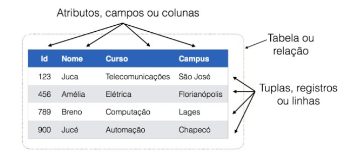
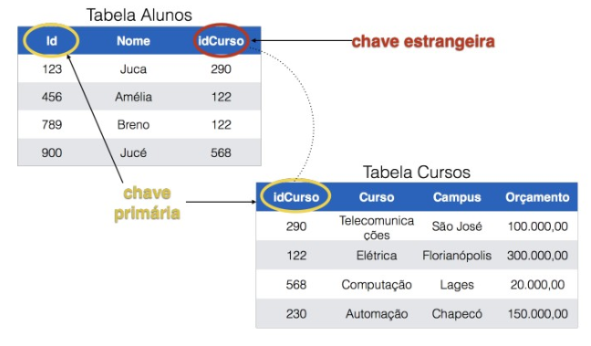

# Conceitos Gerais

---

## Tabelas

Em um banco de dados relacional os dados estão organizados na forma de tabelas, que são compostas por linhas e colunas:

Tabela é um conjunto não ordenado de linhas (tuplas). Cada linha é composta por uma série de campos (colunas ou atributos).

---

## Chaves

Chave em um banco de dados relacional tem por objetivo identificar linhas e estabelecer relações entre linhas de diferentes tabelas. Existem dois tipos de chaves, as chaves primárias PK (primary key) e as chaves estrangeiras FK (Foreign Key)

Chave primária (primary key – PK): Coluna ou combinação de colunas cujos valores distinguem uma linha das demais dentro de uma relação. A coluna configurada como chave primária, sempre terá a caractéristica se ser não nula (not null) e única (uniq), ou seja, a coluna não pode ser valor nulo e nem pode se repetir. Isso faz com que esta chave seja um identificador único do registro, garantindo que não exista nenhuma outra linha na tabela que possui o mesmo identificador.

Chave estrangeira (foreign key – FK): Coluna ou combinação de colunas (que são chaves primárias de uma tabela) cujo valores aparecerem em uma outra tabela. Este mecanismo, de exportar uma chave primária de uma tabela para outra tabela como chave estrangeira, é o que permite a implementação de relacionamentos em banco de dados relacionais.

---

# Opção melhorada

---

## Complementos (bem diretos e práticos)

### 1) Linhas x Colunas (jeito mais fácil de lembrar)
- **Linha (tupla / registro):** “uma coisa inteira”  
  Ex.: uma pessoa (Ana, 1990-05-12, F).
- **Coluna (atributo / campo):** “um pedaço da coisa”  
  Ex.: nome, data_nascimento, sexo.

---

### 2) Exemplo rápido de tabela (visual)
Imagine a tabela **pessoa**:

| id_pessoa | nome       | sexo |
|----------:|------------|:----:|
| 1         | Ana Silva  |  F   |
| 2         | Bruno Costa|  M   |

- Cada **linha** é um registro.
- Cada **coluna** é um atributo.

---

### 3) PK (Primary Key) — para que serve na prática
A **PK**:
- **identifica** um registro sem dúvida.
- não pode ser **NULL**.
- não pode **repetir**.

Ex.: `id_pessoa` é a PK.  
Se alguém falar “pessoa 2”, você sabe exatamente quem é.

---

### 4) FK (Foreign Key) — como “liga” tabelas
A **FK** é uma coluna que aponta para a **PK de outra tabela**.

Exemplo clássico:
- `pessoa(id_pessoa)` é PK
- `telefone(id_pessoa)` é FK (referencia `pessoa.id_pessoa`)

Isso significa:
- um telefone pertence a **uma pessoa**
- uma pessoa pode ter **vários telefones**

---

### 5) Integridade referencial (o que a FK garante)
Com FK ativada:
- você **não consegue** cadastrar telefone para uma pessoa que **não existe**.

Ex.: tentar inserir `telefone.id_pessoa = 999` sem existir `pessoa.id_pessoa = 999` → o banco bloqueia.

---

### 6) Por que “tabela é um conjunto não ordenado”
Porque o banco **não garante** a ordem das linhas.
- Se você quer ordem, você usa **ORDER BY**.

Ex.:
    SELECT * FROM pessoa
    ORDER BY nome;

---

## Exercícios (rápidos, pra fixar)

### Exercício 1 — Identificando PK e FK
Dadas as tabelas:
- pessoa(id_pessoa, nome)
- telefone(id_telefone, telefone, id_pessoa)

Responda:
1) Qual é a PK de cada tabela?  
2) Qual coluna é FK? Aponta para qual tabela/coluna?

---

### Exercício 2 — Pensando em regras
1) Por que `id_pessoa` (PK) não pode ser NULL?  
2) O que aconteceria se `telefone.id_pessoa` não tivesse FK?

---

### Exercício 3 — Escrevendo SQL simples
1) Liste todas as pessoas:
    SELECT * FROM pessoa;

2) Liste telefones com o nome da pessoa (JOIN):
    SELECT p.nome, t.telefone
    FROM pessoa p
    JOIN telefone t ON t.id_pessoa = p.id_pessoa;

<!-- nav_start -->
---
Anterior: [145 Sistema Escolar](../docs/145_Sistema_Escolar.md) | Proximo: [147 Conceito Joins](../docs/147_Conceito_Joins.md) | [Voltar ao Indice](../README.md)
<!-- nav_end -->
