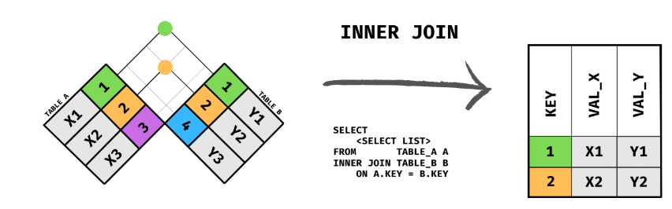
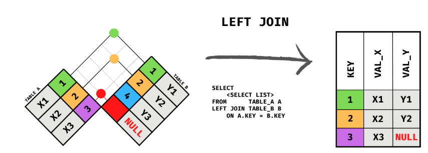
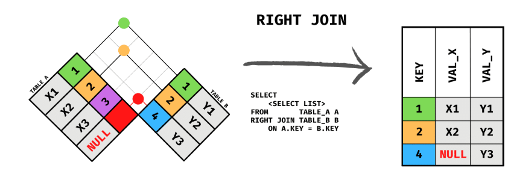
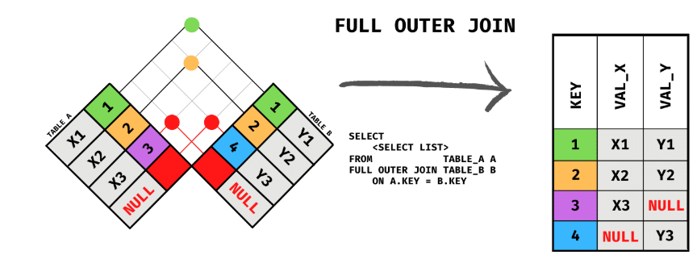

# Conceito Joins

---

A instrução JOIN, como o próprio nome sugere, é usada para vincular dados de duas tabelas relacionadas por meio de um campo em comum (normalmente uma chave estrangeira), resultando em linhas que combinam dados das duas (ou mais) tabelas nas quais a junção foi realizada.

O JOIN é, sem dúvida, uma das operações mais importantes em SQL, mas também uma das mais difíceis de entender. Para ilustrar os diferentes tipos de JOIN, a imagem a seguir descreve como cada JOIN se comporta. Vamos explicar cada um com um pouco mais de detalhes:

---

## Junção interna (Inner Join) - Interseção

Esta é a junção clássica. A junção padrão aplicada quando nenhum outro método é especificado na consulta. Ela retorna apenas as linhas onde há uma correspondência, ou seja, o valor do campo na tabela A usado para a junção corresponde ao valor do campo correspondente na tabela B.

Exemplo: retornar todos os produtos para os quais houve pelo menos um pedido nos últimos dias (a junção interna vinculará o campo do produto na tabela Pedido com a chave primária desse produto na tabela Produto).

---

## Junção Externa à Esquerda (Left Outer Join)

Quando você deseja listar todas as linhas que possuem uma correspondência, mas também aquelas da Tabela A que não possuem correspondência. Seguindo o exemplo anterior, se você quiser listar todos os produtos com seus respectivos dados de pedido, mas também mostrar os produtos para os quais ainda não há um pedido, a solução seria realizar uma Junção Externa à Esquerda entre Produto e Pedido.

---

## Junção externa à direita  (Rigth Outer Join)

Exatamente a mesma coisa, mas ao contrário, quando você deseja listar as linhas da tabela B mesmo que elas não estejam relacionadas a nenhuma linha da tabela A. É um operador um tanto redundante, já que você poderia simplesmente inverter a ordem das tabelas na junção e usar uma junção externa à esquerda para obter o mesmo efeito. No entanto, como parte de junções múltiplas, é útil ter ambas para uma melhor compreensão da consulta.

---

## Junção externa completa (Full Outer join) - União

Obs: Full join não é suportado pelo MySQL, porem o mesmo resultado é obtido com um union de um left join com um rigth join

É como a soma das duas anteriores. Queremos as linhas de A e B, independentemente de haver correspondência ou não (obviamente, quando houver correspondência, a consulta retornará todos os campos de A e B que especificamos; quando não houver correspondência, a consulta retornará apenas os campos de A ou B).

---

## Outras junções possíveis

---

# Opção melhorada

---

## Complementos (com exemplos bem práticos)

### Antes de tudo: o “campo em comum” é a ponte
Quase sempre você faz JOIN assim:
- **Tabela A** tem a **PK** (ex.: `produto.id_produto`)
- **Tabela B** tem a **FK** apontando pra PK (ex.: `item_pedido.id_produto`)

A condição de junção geralmente é:
    ON B.fk = A.pk

---

## INNER JOIN (interseção)
**O que sai:** só o que existe nos dois lados (casamento perfeito).

Exemplo (produtos que aparecem em algum item de pedido):
    SELECT p.id_produto, p.nome, ip.quantidade
    FROM produto p
    INNER JOIN item_pedido ip
        ON ip.id_produto = p.id_produto;

**Interpretação:** “Me mostre produtos que têm correspondência em item_pedido.”

---

## LEFT JOIN (tudo da esquerda + o que casar na direita)
**O que sai:**
- **todas** as linhas da tabela da esquerda (A)
- e os dados da direita (B) **quando existir correspondência**
- quando não existir, os campos da direita vêm como **NULL**

Exemplo (todos os produtos, vendendo ou não vendendo):
    SELECT p.id_produto, p.nome, ip.id_item_pedido
    FROM produto p
    LEFT JOIN item_pedido ip
        ON ip.id_produto = p.id_produto;

**Como descobrir “quem não tem correspondência”:**
    SELECT p.id_produto, p.nome
    FROM produto p
    LEFT JOIN item_pedido ip
        ON ip.id_produto = p.id_produto
    WHERE ip.id_item_pedido IS NULL;

---

## RIGHT JOIN (tudo da direita + o que casar na esquerda)
**É o espelho do LEFT JOIN.**
Geralmente dá pra evitar invertendo as tabelas e usando LEFT JOIN.

Exemplo (todos os itens, mesmo que produto esteja faltando — raro em banco bem modelado):
    SELECT p.nome, ip.id_item_pedido
    FROM produto p
    RIGHT JOIN item_pedido ip
        ON ip.id_produto = p.id_produto;

**Observação prática:** em modelagem correta com FK, “item sem produto” normalmente nem deveria existir.

---

## FULL OUTER JOIN (união total)
**MySQL não suporta** FULL JOIN direto.  
Você simula com:
- um LEFT JOIN
- UNION
- com um RIGHT JOIN

Exemplo (retornar tudo dos dois lados, casando quando der):
    SELECT p.id_produto, p.nome, ip.id_item_pedido
    FROM produto p
    LEFT JOIN item_pedido ip
        ON ip.id_produto = p.id_produto

    UNION

    SELECT p.id_produto, p.nome, ip.id_item_pedido
    FROM produto p
    RIGHT JOIN item_pedido ip
        ON ip.id_produto = p.id_produto;

---

## Erro clássico: WHERE mata o LEFT JOIN
Se você fizer:
    SELECT p.nome, ip.id_item_pedido
    FROM produto p
    LEFT JOIN item_pedido ip ON ip.id_produto = p.id_produto
    WHERE ip.id_item_pedido > 0;

Você transformou na prática em **INNER JOIN**, porque o WHERE elimina os NULL.

**Quando a regra é da tabela da direita, e você quer manter o LEFT JOIN:**
Coloque a condição no ON (quando fizer sentido):
    SELECT p.nome, ip.id_item_pedido
    FROM produto p
    LEFT JOIN item_pedido ip
        ON ip.id_produto = p.id_produto
       AND ip.id_item_pedido > 0;

---

## “Outras junções possíveis” (o que costuma cair na prática)

### CROSS JOIN (produto cartesiano)
Combina tudo com tudo:
    SELECT p.nome AS produto, c.nome AS categoria
    FROM produto p
    CROSS JOIN categoria c;

Uso comum: gerar combinações, testes ou relatórios específicos (com cuidado, explode rápido).

### SELF JOIN (tabela com ela mesma)
Útil quando a tabela referencia ela própria (ex.: categoria pai/filha, funcionário/gerente).
Exemplo genérico:
    SELECT a.nome AS funcionario, b.nome AS gerente
    FROM funcionario a
    LEFT JOIN funcionario b ON b.id_funcionario = a.id_gerente;

---

## Exercícios (sem enrolação)

### 1) INNER JOIN
1) Liste `nome do cliente` + `id_pedido` (somente clientes que têm pedido).

### 2) LEFT JOIN
1) Liste todos os clientes e, se tiver, o número do pedido.  
2) Mostre apenas os clientes que **nunca** fizeram pedido.

### 3) FULL JOIN (simulação no MySQL)
1) Faça uma consulta que traga todos os produtos e todos os itens de pedido, mesmo quando não houver correspondência.

### 4) Pegadinha do WHERE
1) Faça um LEFT JOIN e aplique uma condição na tabela da direita primeiro no WHERE e depois no ON. Compare os resultados.
<!-- nav_start -->
---
Anterior: [Conceitos Gerais](../docs/146_Conceitos_Gerais.md) | Próximo: [Entrega: Hackathon](../docs/148_Entrega_Hackathon.md) | [Voltar ao Índice](../README.md)
<!-- nav_end -->

