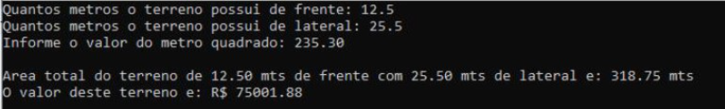
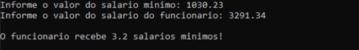
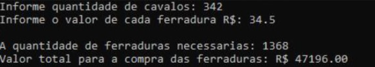
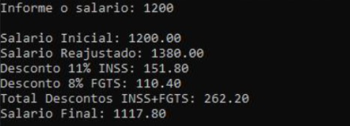
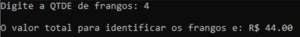
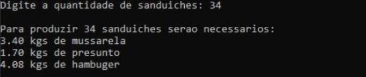

# Lista de Exercícios 1

Estes exercícios não precisam ser entregues.

---

## Exercício 01
Uma imobiliária vende apenas terrenos retangulares. Faça um algoritmo para imprimir a área do terreno e o valor de venda do mesmo. Para isto será necessário o usuário informar as dimensões em metros (frente e lateral) do terreno além do valor cobrado pelo metro quadrado.

**Exemplo do Resultado:**

---

## Exercício 02
Faça um algoritmo que receba o valor do salário mínimo e o valor do salário de um funcionário, calcule e mostre a quantidade de salários mínimos que ganha esse funcionário.

**Exemplo do Resultado:**

---

## Exercício 03
Faça um algoritmo para calcular quantas ferraduras são necessárias para equipar todos os cavalos comprados para um haras. O usuário devera informar a quantidade de cavalos adquiridos.

**Exemplo do Resultado:**

---

## Exercício 04
Faça um algoritmo para ler o salário de um funcionário e aumentá-lo em 15%. Após o aumento, desconte 11% de INSS e 8% de FGTS. Imprima o salário inicial, o salário com o aumento, o salário final, o desconto do INSS, o desconto do FGTS e o Total de Descontos (INSS+FGTS).

**Resultado esperado:**

---

## Exercício 05
A granja Frangotech possui um controle automatizado de cada frango da sua produção. No pé direito do frango há um anel com um chip de identificação; no pé esquerdo são dois anéis para indicar o tipo de alimento que ele deve consumir. Sabendo que o anel com chip custa R$4,00 e o anel de alimento custa R$3,50, faça um algoritmo para calcular o gasto total da granja para marcar todos os seus frangos que deverá ser informado pelo usuário.

**Resultado esperado:**

---

## Exercício 06
A lanchonete Gostosura vende apenas um tipo de sanduíche, cujo recheio inclui duas fatias de queijo, uma fatia de presunto e uma rodela de hambúrguer. Sabendo que cada fatia de queijo ou presunto pesa 50 gramas, e que a rodela de hambúrguer pesa 120 gramas, faça um algoritmo em que o dono forneça a quantidade de sanduíches a fazer, e a máquina informe as quantidades (em quilos) de queijo, presunto e carne necessários para compra.

**Resultado esperado:**

<!-- nav_start -->
---
Anterior: [Seu primeiro algoritmo em Java](../docs/25_Primeiro_Algoritmo_Java.md) | Próximo: [Instalação do Java](../docs/27_Instalacao_Java.md) | [Voltar ao Índice](../README.md)
<!-- nav_end -->

