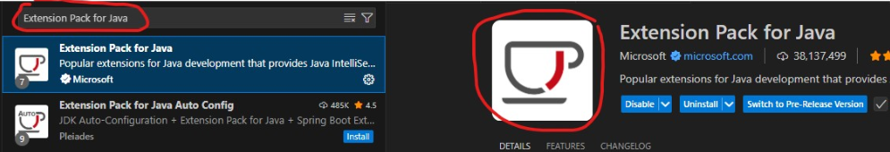

# Instalação do VSCode e Plugins

---

## Instalação do VSCode e Plugins

https://www.youtube.com/watch?v=vP8YMqN4MQQ

Após a instalação do VSCode, instalar a extensão

**"Extension Pack For Java"**.

---

# Complemento da Lição

## 1) Resultado esperado (o que deve funcionar no final)
Depois de instalar o VSCode + plugins, você deve conseguir:

- criar um arquivo `Main.java`
- ter **autocompletar** (sugestões)
- ter **Run/Debug** para rodar o Java
- ver erros de compilação destacados no editor

---

## 2) Checklist rápido (para validar se está tudo ok)
- [ ] VSCode instalado
- [ ] Extensão **Extension Pack for Java** instalada
- [ ] Reiniciei o VSCode após instalar extensões
- [ ] Consigo abrir/rodar um arquivo `.java` pelo VSCode

---

## 3) Mini-teste (pra confirmar que o VSCode está “pronto”)
Crie um arquivo `Main.java` e cole:

    public class Main {
        public static void main(String[] args) {
            System.out.println("VSCode + Java OK!");
        }
    }

Tente executar pelo botão **Run** (ou pelo menu Run/Debug).

---

## 4) Pergunta única (para checar que fixou)
Qual é o nome do pacote de extensões que você deve instalar para programar em Java no VSCode?

---
<!-- nav_start -->
---
Anterior: [JDK, JRE e JVM](../docs/28_JDK_JRE_JVM.md) | Próximo: [Lista de Exercícios 2](../docs/30_Lista_Exercicios_2.md) | [Voltar ao Índice](../README.md)
<!-- nav_end -->

