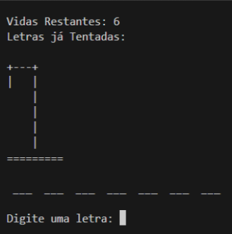
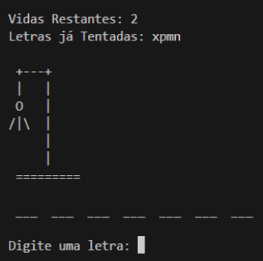
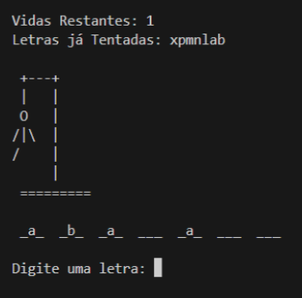
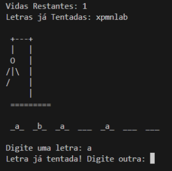
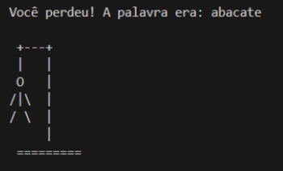
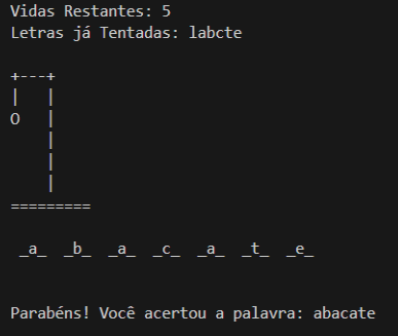

# ✅ Requisitos do Jogo da Forca

---

## 🧩 Jogo da Forca — Requisitos Funcionais

### Requisito 1.1: Leitura das Palavras
- O sistema deve carregar uma lista de palavras a partir de um arquivo de texto (**palavras.txt**).
- Cada linha do arquivo representa uma palavra distinta.
- Caso o arquivo não exista ou esteja vazio, o jogo não deve iniciar e uma mensagem de erro deve ser exibida.

### Requisito 1.2: Seleção da Palavra Secreta
- O jogo deve escolher aleatoriamente uma palavra da lista carregada.
- A palavra escolhida deve ser convertida para letras minúsculas.

### Requisito 1.3: Mecânica de Jogo
- A cada interação do jogo a console deve ser limpa para gerar a sensação de tela atualizada.
- O jogador inicia com **6 vidas**.
- A cada rodada, o jogador deve digitar **uma letra**.
- Letras repetidas não devem ser aceitas novamente. Caso isto ocorra o jogador deve ser alertado e solicitado a digitar outra letra.
- Se a letra estiver na palavra, ela é exibida nas posições corretas conforme a palavra.
- Se a letra não estiver na palavra, o jogador perde uma vida, e um novo desenho da forca deve ser exibido.

### Requisito 1.4: Fim de Jogo
- O jogo termina quando:
  - O jogador acerta todas as letras da palavra (**vitória**).
  - O jogador perde todas as vidas (**derrota**).
- Ao final do jogo, deve ser exibida:
  - A palavra secreta.
  - Uma mensagem de vitória ou derrota e o estado de como estava a forca.

### Requisito 1.5: Exibição da Forca
- A cada erro, uma nova parte da forca deve ser exibida, até completar o desenho ao fim das 6 tentativas.
- A forca deve ser desenhada utilizando caracteres de texto para simular ao conceito de **Art ASCII**.

### Requisito 1.6: Interface de Texto
- O jogo deve funcionar em um terminal/console.
- A tela deve ser limpa a cada nova jogada para atualizar a exibição do estado atual do jogo.

### Requisito 1.7: Informações Visuais Durante o Jogo
Durante o jogo, deve ser exibido:
- Quantidade de vidas restantes.
- Letras já tentadas.
- A palavra com letras adivinhadas no formato `__X__` onde **X** são as letras já adivinhadas e `_____` para as letras ainda ocultas.
- A forca correspondente ao número de erros.

---

## 🎭 Desenho da Forca (ASCII)

### 6 vidas:
    +---+
    |   |
        |
        |
        |
        |
    =========

### 5 vidas:
    +---+
    |   |
    O   |
        |
        |
        |
    =========

### 4 vidas:
    +---+
    |   |
    O   |
    |   |
        |
        |
    =========

### 3 vidas:
    +---+
    |   |
    O   |
   /|   |
        |
        |
    =========

### 2 vidas:
    +---+
    |   |
    O   |
   /|\  |
        |
        |
    =========

### 1 vida:
    +---+
    |   |
    O   |
   /|\  |
   /    |
        |
    =========

### Perdeu:
    +---+
    |   |
    O   |
   /|\  |
   / \  |
        |
    =========

---

## 🛡️ Requisitos Não Funcionais

### 2.1. Estrutura de Arquivo
- O arquivo **palavras.txt** deve estar localizado em um caminho acessível e correto, definido no código.
- Exemplo de caminho absoluto:
  - `C:\jogoForca\src\palavras.txt`

### 2.3. Usabilidade
- O jogo deve ser jogável apenas com entrada de texto via teclado.
- Não deve permitir entrada inválida (como strings ou números em vez de uma única letra).

---

## 🖥️ Exemplos de Telas

- Início do Jogo  
  

- Algumas Letras já tentadas  
  

- Algumas Letras Acertadas  
  

- Letra Repetida  
  

- Jogador Perdeu  
  

- Jogador Ganhou  
  

---

## Complemento da Lição

### Critérios de aceite (transformando requisitos em “checagens”)
- **Arquivo de palavras**
  - Se `palavras.txt` não existir → mostrar erro e encerrar.
  - Se existir mas não tiver nenhuma palavra válida → mostrar erro e encerrar.
- **Escolha da palavra**
  - Sorteio aleatório sempre dentro da lista carregada.
  - Palavra normalizada para minúsculas (e decisão sobre acentos).
- **Entrada do jogador**
  - Aceitar **apenas 1 caractere**.
  - Rejeitar número/símbolo/espaço.
  - Rejeitar letra repetida **sem perder vida** (apenas avisar e pedir outra).
- **Atualização de tela**
  - A cada rodada: limpar console + exibir forca + vidas + tentadas + palavra parcial.
- **Fim do jogo**
  - Vitória: palavra completa revelada.
  - Derrota: vidas = 0, exibir forca final + palavra secreta.

---

### Casos de borda que costumam quebrar jogos de forca
- Palavra com hífen/espaço (ex.: “fim-de-semana”) — vai tratar como caractere fixo ou vai remover?
- Letras com acento (ex.: “maçã”) — vai comparar por acento ou normalizar (“a” casa com “á”)?
- `palavras.txt` com linhas em branco — ignorar.
- Jogador digita “AA” ou “a ” — precisa cortar espaços e validar.

---

### Roteiro de implementação (tarefas pequenas)
1. Carregar lista do arquivo e validar (erro se vazio).
2. Sortear palavra e preparar “máscara” (ex.: `_ _ _ _`).
3. Criar estrutura para letras tentadas (ideal: conjunto).
4. Loop principal do jogo:
   - limpar console
   - mostrar status
   - ler letra (validar)
   - atualizar máscara ou vidas
   - checar vitória/derrota
5. Mostrar tela final (mensagem + palavra secreta + forca final).

---

### Mini-exercício de fixação (bem direto)
Implemente primeiro **apenas a validação da entrada**:
- lê algo do usuário
- garante que é **uma única letra**
- normaliza para minúsculo
- rejeita se já tiver sido tentada

---

**Pergunta (uma só):** você vai implementar esse jogo em **Java no console** mesmo (como no curso/1000devs), ou em outra linguagem?

<!-- nav_start -->
---
Anterior: [Jogo da Forca](../docs/47_Jogo_da_Forca.md) | Próximo: [Teste 1: Deve ser resolvido até 10/10/2025](../docs/49_Teste_1.md) | [Voltar ao Índice](../README.md)
<!-- nav_end -->

