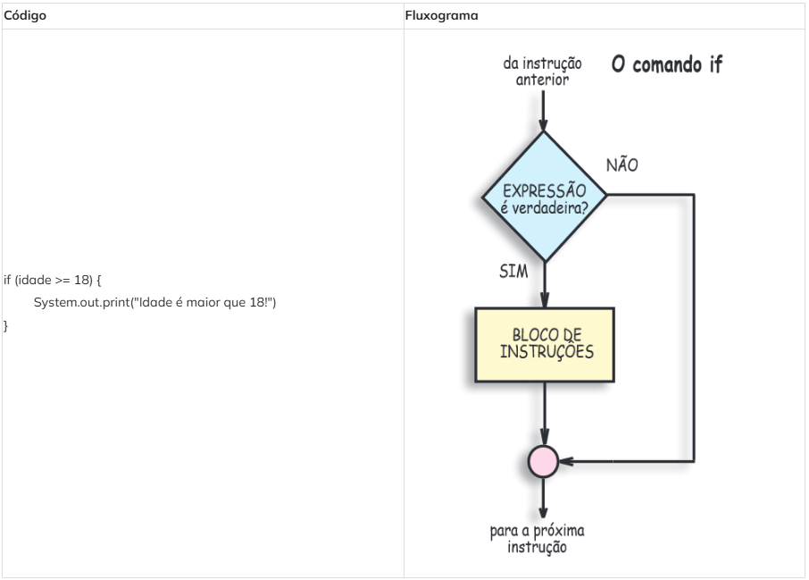
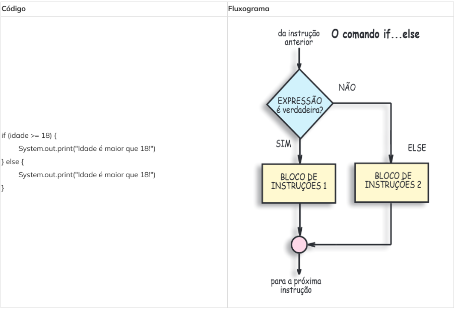
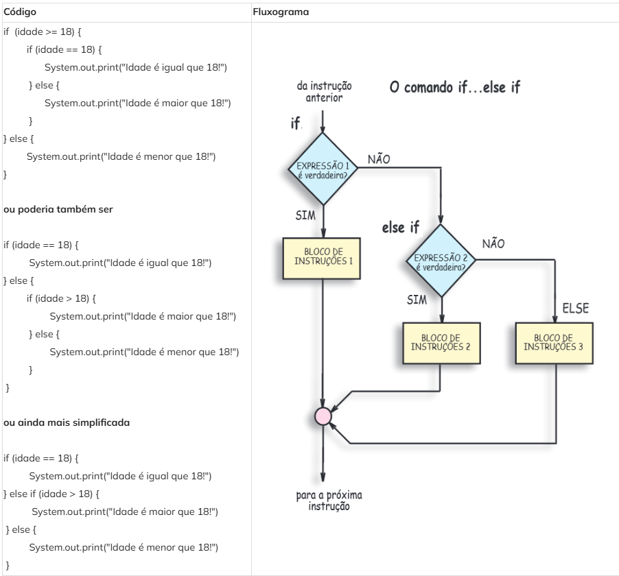

# Resumo Estruturas de Decisão

## Estrutura de Decisão Simples
**Estrutura de Decisão Simples:** Nesta estrutura nosso código consegue avaliar e executar um bloco de comandos para apenas uma única condição.

---

## Estrutura de Decisão Composta
**Estrutura de Decisão Composta:** Nesta estrutura nosso código consegue avaliar e executar dois blocos de comandos para duas condições.

---

## Estrutura de Decisão Múltipla
**Estrutura de Decisão Múltipla:** Nesta estrutura nosso código consegue avaliar e executar três blocos de comandos para cada uma das respectivas condições.

---

## Estruturas que não existem

### Else sem um if iniciando:
    else {
    }

### Else com uma condição se if antes:
    else (condicao) {
    }

