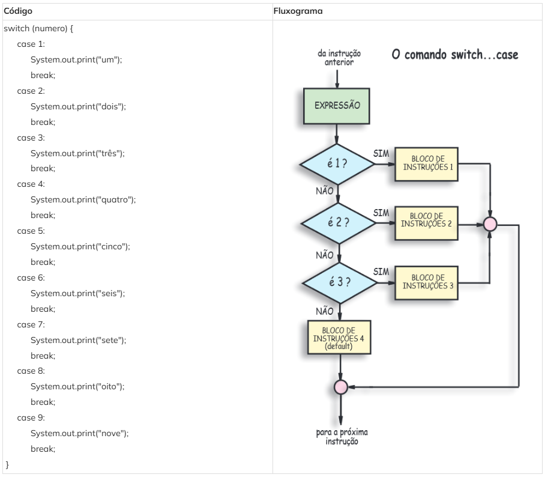

# ✅ Conceito Switch Case

---

O **switch case** é uma estrutura de controle de fluxo usada em linguagens como **Java**, **C** e **JavaScript** para executar **blocos diferentes de código** conforme o valor de uma variável.

Ele é uma alternativa mais **organizada e legível** ao uso de muitos `if` e `else if`, principalmente quando você faz várias comparações do tipo:

- `numero == 1`
- `numero == 2`
- `numero == 3`
- etc...

---

## 🎯 Exemplo com if / else if

Imagine um código para converter um número para sua escrita por extenso:

    if (numero == 1) {
       System.out.print("um")
    } else if (numero == 2) {
       System.out.print("dois")
    } else if (numero == 3) {
       System.out.print("três")
    } else if (numero == 4) {
       System.out.print("quatro")
    } else if (numero == 5) {
       System.out.print("cinco")
    } else if (numero == 6) {
       System.out.print("seis")
    } else if (numero == 7) {
       System.out.print("sete")
    } else if (numero == 8) {
       System.out.print("oito")
    } else if (numero == 9) {
       System.out.print("9")
    }

✅ Note que nesse código estamos sempre comparando a variável **numero** com igualdade `==`.

Quando isso acontece, podemos usar o **switch case**, evitando repetir `numero == ...` várias vezes.

---

## ✅ Mesmo exemplo (trecho) com if / else if

    if (numero == 1) {
                System.out.print("um");
             } else if (numero == 2) {
                System.out.print("dois");
             } else if (numero == 3) {
                System.out.print("três");
             } else if (numero == 4) {
                System.out.print("quatro");
             } else if (numero == 5) {
                System.out.print("cinco");
             } else if (numero == 6) {
                System.out.print("seis");
             } else if (numero == 7) {
                System.out.print("sete");
             } else if (numero == 8) {
                System.out.print("oito");
             } else if (numero == 9) {
                System.out.print("9");
             }

---

## ⭐ O papel do `default` (como se fosse um else)

O **switch case** também pode ter um comportamento igual ao `else`.  
Ou seja, se o valor **não se encaixar em nenhum case**, você define um padrão com `default` (normalmente a última opção).

---

## ✅ Exemplo de agrupamento de condições

Caso você tenha um trecho equivalente a este:

    if (numero == 1 || numero == 2) {
          //execute algo
    } else if (numero >= 3 && numero <= 6 ) {
          //execute isto
    }

Podemos atingir o mesmo resultado usando:

    switch (numero) {
        case 1:
        case 2:
            // Execute algo
            break;

        case 3:
        case 4:
        case 5:
        case 6:
            // Execute isto
            break;
    }

📌 **Como funciona aqui?**
- Como não temos nada logo depois de `case 1`, ele “cai” para o próximo (`case 2`) e executa o bloco.
- Então esse bloco será executado se `numero` for **1 ou 2**.

O mesmo ocorre com **3, 4, 5 e 6**:
- Como não há código individual nesses `case`, todos executam o mesmo bloco `"// Execute isto"`.

---

## Complemento da Lição

### ✅ Quando vale a pena usar `switch` (regra prática)
Use `switch` quando:
- você está comparando **uma mesma variável**
- com **valores fixos** (igualdade)
- e teria muitos `else if`

Ex.: menu (1, 2, 3), dia da semana (1..7), opções de sistema, letras específicas.

---

### ⚠️ O `break` é o “freio”
Sem `break`, o Java continua executando os próximos `case` (isso se chama **fall-through**).

Exemplo do problema (sem `break`):
    switch (numero) {
        case 1:
            System.out.println("um");
        case 2:
            System.out.println("dois");
    }

Se `numero = 1`, imprime:
- "um"
- "dois"

---

### ✅ `switch` moderno (Java 14+): formato mais limpo
Em versões mais novas do Java, existe o `switch` com seta `->`:

    switch (numero) {
        case 1 -> System.out.println("um");
        case 2 -> System.out.println("dois");
        default -> System.out.println("inválido");
    }

Nesse formato:
- não precisa `break`
- fica bem mais legível

---

### 🎯 Exercício rápido (para fixar)
Pegue o **Exercício 06 — Dia da semana** (1 a 7) e pense:
- como ficaria com `if/else if/else`
- e como ficaria com `switch` usando `default` para inválido

---

<!-- nav_start -->
---
Anterior: [59 Lista Exercicios 03](../docs/59_Lista_Exercicios_03.md) | Proximo: [61 Video Switch Case](../docs/61_Video_Switch_Case.md) | [Voltar ao Indice](../README.md)
<!-- nav_end -->
